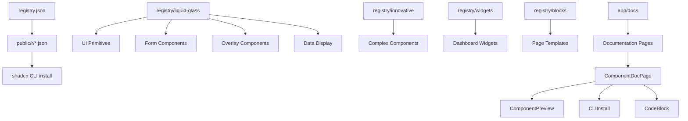

# Ein UI — Project Review & Next-Level Strategy

> **Repository:** https://github.com/einui/einui
> **Website:** https://ui.eindev.ir
> **Review Date:** July 2026
> **Reviewer:** Principal Frontend Architect

---

## Table of Contents

1. [Executive Summary](#section-1--executive-summary)
2. [Repository Review](#section-2--repository-review)
3. [Design System Review](#section-3--design-system-review)
4. [Component Library Review](#section-4--component-library-review)
5. [Registry Review](#section-5--registry-review)
6. [Documentation Review](#section-6--documentation-review)
7. [Developer Experience](#section-7--developer-experience)
8. [Open Source Readiness](#section-8--open-source-readiness)
9. [Performance Review](#section-9--performance-review)
10. [Accessibility Review](#section-10--accessibility-review)
11. [Production Readiness Checklist](#section-11--production-readiness-checklist)
12. [Competitive Analysis](#section-12--competitive-analysis)
13. [Next Level Ideas](#section-13--next-level-ideas)
14. [Roadmap](#section-14--roadmap)
15. [Prioritized Action Plan](#section-15--prioritized-action-plan)
16. [Final Verdict](#section-16--final-verdict)

---

## Section 1 — Executive Summary

### Current Maturity Level

**Early Beta.** Ein UI has a strong foundation — a complete visual identity, a 42-item registry, a documentation site, and working CI. The project is further along than most early-stage UI libraries. It is not yet production-ready for third-party adoption, but it is production-ready for the maintainer's own projects.

### Biggest Strengths

- **Unique visual identity.** The liquid glass aesthetic (frosted glass, cyan-blue-purple gradients, glow effects) is genuinely distinctive. This is the project's moat.
- **Shadcn registry compatibility.** Working `shadcn@latest add @einui/glass-button` flow is correctly implemented with individual JSON manifests in `public/r/`.
- **Comprehensive registry.** 42 registered items spanning primitives, forms, overlays, data display, innovative components, widgets, and blocks.
- **Strong Radix UI foundation.** Many components wrap `@radix-ui/*` primitives, inheriting accessibility and keyboard support.
- **TypeScript throughout.** Strict mode, proper prop interfaces, `forwardRef` patterns.
- **Copilot instructions.** `.github/copilot-instructions.md` (353 lines) is exceptional — it documents conventions, workflow, and quality gates for AI contributors.
- **Framer Motion integration.** Tab transitions, checkbox animations, textarea entry effects — tasteful use of motion.

### Biggest Weaknesses

- **Test coverage is critically low.** 1 test file (`GlassButton.test.tsx` — 223 lines) for 42 registered components. This is a blocker for OSS contribution confidence.
- **CI workflows are placeholders.** Accessibility audit, visual regression, and registry publish all have `echo "placeholder"` as their actual step.
- **Dashboard block is unregistered.** `registry/blocks/dashboard/page.tsx` exists on disk but is missing from `registry.json`.
- **No changelog, no release workflow, no semantic versioning.** The project has version `1.0.0` but no mechanism to publish updates.
- **All components are `"use client"`.** No server components, no progressive enhancement, no streaming support.
- **No npm package.** `package.json` has `"private": true`. Distribution is registry-only. This limits adoption vectors.
- **Empty `docs/` directory** at the repository root — confusing for new contributors.
- **No Storybook, no playground, no interactive prop editor.** Documentation is static code snippets only.
- **Duplicate component systems.** `components/ui/` (standard shadcn-like components) and `registry/liquid-glass/` (glass variants) are separate. This creates confusion about which set to use.

### Overall Project Score

| Dimension | Score (1–10) |
|-----------|:------------:|
| Visual Design | 9 |
| Component Architecture | 7 |
| Code Quality | 7 |
| TypeScript | 8 |
| Documentation | 6 |
| Testing | 2 |
| Accessibility | 5 |
| Performance | 5 |
| OSS Readiness | 4 |
| DX | 6 |
| **Overall** | **5.9** |

### Production Readiness

**Not yet.** The project can be used in production by the maintainer (who knows the internals) but lacks the testing, accessibility validation, and stability guarantees required for third-party production use.

### OSS Readiness

**Not yet.** The project has good bones (README, CONTRIBUTING, CODE_OF_CONDUCT, issue templates, PR template) but is missing release workflows, changelog, automated testing, semantic versioning, and community tooling.

### Recommendation for the Next Milestone

**Reach "OSS Beta" by v1.0:** Ship 80% test coverage, automate the registry publish workflow, register the dashboard block, add a changelog, implement visual regression testing, and publish a public roadmap. This makes the project credible enough for community contributions.

---

## Section 2 — Repository Review

### Folder Structure

```
einui/
├── app/                  # Next.js App Router (docs site + homepage)
│   ├── docs/             # Documentation pages
│   │   ├── blocks/       # Block preview pages
│   │   ├── components/   # Component doc pages ([slug])
│   │   └── ...
│   └── layout.tsx        # Root layout with analytics, fonts, SEO
├── components/           # Doc site components
│   ├── docs/             # Documentation UI (code blocks, nav, etc.)
│   ├── home/             # Homepage components
│   ├── seo/              # JSON-LD structured data
│   └── ui/               # Standard shadcn-like UI components
├── contants/             # (Typo: should be "constants") Navigation items, mock data
├── docs/                 # EMPTY — confusing
├── hooks/                # Custom hooks (use-mobile)
├── lib/                  # Utilities, SEO, syntax highlighting, component registry
├── public/               # Static assets, registry JSON manifests
├── registry/             # 👈 THE COMPONENT LIBRARY
│   ├── blocks/           # Full-page templates (admin, auth, pricing)
│   ├── innovative/       # Complex components (command palette, dock, etc.)
│   ├── liquid-glass/     # Core UI primitives (button, card, input, etc.)
│   └── widgets/          # Dashboard widgets (weather, clock, stocks, etc.)
├── styles/               # Global CSS with CSS variables
├── tests/                # Test files (1 test file for 42 components)
├── types/                # Type declarations
├── registry.json         # Shadcn registry manifest
└── components.json       # Shadcn configuration
```

### What Is Done Well

- **Separation of concerns** is clean: `registry/` for distributable components, `components/` for doc site-specific code.
- **Path aliases** (`@/registry/...`, `@/components/...`) are consistent throughout.
- **Barrel exports** (`index.ts` files) in each registry subdirectory are well-maintained (except `stats-widget` is missing from the widgets barrel).
- **`public/r/` directory** correctly mirrors `registry.json` for individual CLI resolution.
- **Copilot instructions** are embedded in `.github/` — forward-thinking for AI-assisted contributions.

### What Should Be Improved

- **Rename `contants/` to `constants/`.** This is a typo that appears everywhere in imports.
- **Remove the empty `docs/` directory** or populate it — having an empty directory at the root is confusing.
- **Consolidate `components/ui/` and `registry/liquid-glass/`.** The standard shadcn components (`components/ui/button.tsx`, `components/ui/sheet.tsx`) duplicate the registry's glass components. Either make `components/ui/` re-export the glass versions, or remove them. Currently, the docs sidebar uses `components/ui/sidebar` which imports from `components/ui/button`, while blocks import from `@/registry/liquid-glass/glass-button`. This duality is confusing.
- **Add `stats-widget` to the widgets barrel export.** It's in the registry but not re-exported from `registry/widgets/index.ts`.
- **Register the dashboard block** in `registry.json`. It's a complete 239-line block sitting on disk unused.
- **Add a `scripts/` directory** for build/dev utilities to keep root clean.
- **Use `@/constants/` alias** consistently — some files use `@/contants/`.

### Architecture



### Scalability

The current architecture scales to ~100 components before reorganization is needed. The flat structure inside `registry/liquid-glass/` is fine for 21 components but will become unwieldy. Plan for subdirectories by category when crossing 30+ items.

### Code Consistency

- **Naming:** `Glass` prefix is consistent across all registry components. Kebab-case filenames. PascalCase exports. Good.
- **Patterns:** `forwardRef` + `cn()` + `displayName` is universal. Excellent.
- **Imports:** Path alias style is consistent. `@/lib/utils` for `cn()`. Good.
- **One inconsistency:** Some components export `interface GlassXProps` (button, badge, morph-card), others don't export their props interface (card, dialog, sheet, select). Need to standardize.

---

## Section 3 — Design System Review

### Visual Identity

The liquid glass aesthetic is the project's strongest asset. The combination of `backdrop-blur-xl/2xl/3xl`, `bg-white/10-20`, `border-white/20-30`, and cyan-blue-purple gradient accents creates a cohesive, premium feel.

### What Is Done Well

- **Glass effect is consistent** across all components: same `backdrop-blur`, same border opacity, same shadow pattern.
- **Gradient palette** (`from-cyan-500 via-blue-500 to-purple-500`) is used consistently as the primary accent.
- **CSS variables** for glass properties (`--glass-bg`, `--glass-border`, `--glass-shadow`, etc.) in `app/globals.css` allow centralized customization.
- **Glow effect pattern** (wrapper div with `absolute -inset-1 rounded-xl bg-linear-to-r from-cyan-500/40 via-blue-500/40 to-purple-500/40 blur-lg`) is consistent.
- **Dark mode** is the default (dark-first design), with light mode as a secondary concern — correct for a glass aesthetic.

### Missing Foundations

| Foundation | Status | Priority |
|-----------|--------|----------|
| Design token documentation | ❌ Missing | High |
| Spacing scale documentation | ❌ Missing | Medium |
| Typography scale | ⚠️ Partial (uses Geist font, no scale docs) | Medium |
| Color tokens (beyond shadcn defaults) | ❌ Missing | High |
| Animation tokens (duration, easing) | ❌ Missing | Medium |
| Shadow scale | ⚠️ Implicit (repeated in each component) | Medium |
| Radius scale | ⚠️ Implicit (`rounded-xl`, `rounded-2xl`) | Low |
| Component visual inventory | ❌ Missing | Medium |
| Accessibility guidelines | ❌ Missing | High |

### Specific Issues

1. **No design token file.** CSS custom properties for glass effects are in `app/globals.css` but there's no centralized design token documentation or JSON file that defines the full spectrum.
2. **Hardcoded values.** Shadow values like `shadow-[0_8px_32px_rgba(0,0,0,0.37)]` are repeated in every component. These should be CSS variables or a reusable `glass-shadow` utility class.
3. **Glass utility classes exist but aren't used.** `app/globals.css` defines `.glass-surface`, `.glass-glow`, `.glass-highlight`, and `.glass-inner-shadow` utility classes, but most components still use inline Tailwind classes instead of these utilities. The components should reference these utilities for consistency.
4. **Spacing is inconsistent.** Some components use `p-6` (card), others `p-4` (notification, input). There's no documented spacing scale.
5. **Animation durations vary.** `transition-all duration-300` in button vs `transition-all duration-200` in checkbox — no documented animation scale.
6. **No `prefers-reduced-motion` beyond MotionConfig.** While `motion-config.tsx` sets `reducedMotion="user"` for framer-motion, CSS animations (like the tab list glow pulse) don't respect reduced motion.
7. **Light mode is under-tested.** The dark-first approach means light mode may look broken — this needs verification.

---

## Section 4 — Component Library Review

### Category: UI Primitives (`registry:ui`)

| Component | API Quality | Props | Reusability | Extensibility | a11y | Animation | Verdict |
|-----------|:-----------:|:-----:|:-----------:|:-------------:|:----:|:---------:|:-------:|
| GlassButton | 8/10 | 8/10 | 9/10 | 8/10 | 7/10 | 7/10 | ✅ Good |
| GlassCard | 7/10 | 6/10 (no variant/size) | 9/10 | 7/10 | 6/10 | 5/10 | ✅ Good, needs variants |
| GlassDialog | 8/10 | 8/10 | 8/10 | 8/10 | 8/10 | 8/10 | ✅ Solid |
| GlassInput | 7/10 | 7/10 | 8/10 | 7/10 | 6/10 | 7/10 | ✅ Good |
| GlassTabs | 8/10 | 8/10 | 8/10 | 8/10 | 8/10 | 9/10 | ✅ Best in library |
| GlassProgress | 7/10 | 6/10 | 8/10 | 7/10 | 5/10 | 7/10 | ⚠️ Needs a11y |
| GlassSlider | 7/10 | 7/10 | 7/10 | 7/10 | 7/10 | 6/10 | ✅ Solid |
| GlassSwitch | 7/10 | 7/10 | 7/10 | 7/10 | 7/10 | 7/10 | ✅ Solid |
| GlassTooltip | 8/10 | 8/10 | 9/10 | 8/10 | 8/10 | 7/10 | ✅ Good |
| GlassBadge | 8/10 | 8/10 | 9/10 | 8/10 | 6/10 (no semantic role) | 5/10 | ✅ Good |

### Category: Form Components (`registry:component`)

| Component | API Quality | Props | Reusability | Extensibility | a11y | Animation | Verdict |
|-----------|:-----------:|:-----:|:-----------:|:-------------:|:----:|:---------:|:-------:|
| GlassSelect | 8/10 | 8/10 | 8/10 | 8/10 | 8/10 | 7/10 | ✅ Solid |
| GlassTextarea | 8/10 | 9/10 | 8/10 | 8/10 | 8/10 | 8/10 | ✅ Best form component |
| GlassCheckbox | 8/10 | 8/10 | 8/10 | 8/10 | 7/10 | 9/10 | ✅ Great animation |
| GlassRadio | 7/10 | 7/10 | 7/10 | 7/10 | 7/10 | 8/10 | ✅ Good |

### Category: Overlays & Data Display

| Component | API Quality | Props | Verdict |
|-----------|:-----------:|:-----:|:-------:|
| GlassSheet | 8/10 | 8/10 | ✅ Solid, uses CVA for side variants |
| GlassPopover | 7/10 | 7/10 | ✅ Good |
| GlassAlertDialog | 7/10 | 7/10 | ✅ Good, depends on GlassButton |
| GlassBreadcrumb | 8/10 | 7/10 | ✅ Good |
| GlassTable | 6/10 | 5/10 | ⚠️ Simple table, no sort/pagination |
| GlassSeparator | 7/10 | 7/10 | ✅ Good |
| GlassSkeleton | 6/10 | 5/10 | ⚠️ Basic, no content layout patterns |
| GlassScrollArea | 7/10 | 7/10 | ✅ Good |

### Category: Innovative Components

| Component | Quality | Complexity | Verdict |
|-----------|:-------:|:----------:|:-------:|
| GlassCommandPalette | 8/10 | High | ✅ Impressive. Keyboard nav, search, positioning, footer. **Best innovative component.** |
| GlassDock | 8/10 | High | ✅ Great. Magnification effect, tooltips, orientation support. Unique selling point. |
| GlassMorphCard | 8/10 | Medium | ✅ Excellent. Mouse-position-based 3D tilt with dynamic light reflection. |
| GlassNotification | 8/10 | High | ✅ Context-based notification system with provider, types, positioning, progress bars. |
| GlassSpotlight | 7/10 | High | ⚠️ Great concept but uses SVG cutout masks which may not work in all contexts. |
| GlassRipple | 7/10 | Medium | ⚠️ Works but `animate-[ripple_0.6s_ease-out_forwards]` depends on a keyframe defined in `app/globals.css` — won't work when copied via CLI. |
| GlassGauge | 7/10 | Medium | ⚠️ Animated SVG gauge is well done. Needs `value` validation (accepts negative/max-exceeding values without clamping). |
| GlassTimeline | 6/10 | Low | ⚠️ Simple. Needs more variant options (horizontal, different marker types). |

### Category: Widgets

| Component | Quality | Data Source | Verdict |
|-----------|:-------:|:-----------:|:-------:|
| BaseWidget | 8/10 | N/A | ✅ Good foundational wrapper |
| CalendarWidget | 7/10 | Static | ✅ Good, but real date integration would elevate it |
| ClockWidget | 7/10 | Live | ✅ Analog + digital + stopwatch. Good variety. |
| WeatherWidget | 6/10 | Static mock | ⚠️ Needs real API integration example |
| StatsWidget | 6/10 | Static | ⚠️ Basic, needs data source integration |
| StockWidget | 6/10 | Static mock | ⚠️ Needs real API integration |

### Category: Blocks

| Block | Quality | Scope | Verdict |
|-------|:-------:|:-----:|:-------:|
| Admin Panel | 7/10 | Full dashboard | ✅ Good, but unregistered (missing from registry.json) |
| Login Page | 7/10 | Auth form | ✅ Clean |
| Signup Page | 7/10 | Multi-step | ✅ Good |
| Forgot Password | 7/10 | 2-state | ✅ Good |
| Pricing Page | 7/10 | Toggle, FAQ | ✅ Good |

### Components That Should Be Merged

- **`components/ui/button.tsx` + `registry/liquid-glass/glass-button.tsx`.** The standard button (shadcn style) and glass button should be unified. Either make glass-button the only button, or provide glass-button as a variant of the standard button.
- **`components/ui/sheet.tsx` + `registry/liquid-glass/glass-sheet.tsx`.** Same issue — two implementations of the same pattern.

### Components That Should Be Split

- **`GlassNotification`** is a monolithic file (291 lines) containing context provider, container, item, standalone component, and types. Should be split into `NotificationContext.tsx`, `NotificationContainer.tsx`, `NotificationItem.tsx`, and a barrel export.
- **`GlassCommandPalette`** (357 lines) should be split into `CommandPaletteDialog.tsx`, `CommandPaletteInput.tsx`, `CommandPaletteList.tsx`, `CommandTrigger.tsx`.

### Components Needing Redesign

- **`GlassTable`** is very basic with no sorting, filtering, pagination, or sticky headers. For a "design system," this needs significant improvement.
- **`GlassSkeleton`** needs content layout patterns (card skeleton, table skeleton, text skeleton) — currently just a pulsing div.
- **`GlassTimeline`** needs horizontal mode, icon variants, and connection line styles.

### Missing Components

| Component | Priority | Why |
|-----------|:--------:|:----|
| Navigation Menu | High | No dropdown/context menu. Essential. |
| Dropdown Menu | High | Radix has `@radix-ui/react-dropdown-menu` — implement it. |
| Accordion | High | Needed for FAQ blocks, docs sidebar sections. |
| Toast/Sonner | High | Notification system exists but no standard toast. |
| Date Picker | High | Most requested form component. |
| Combobox | High | Searchable select. |
| Carousel | Medium | Image carousel / testimonials. |
| Command Menu (simpler) | Medium | Command palette is complex — need a simpler variant. |
| Pagination | Medium | For data tables and lists. |
| Drawer (mobile) | Medium | Sheet works but a dedicated mobile drawer would be cleaner. |
| Color Picker | Low | Niche but useful. |
| File Upload | Medium | Drag-and-drop file upload zone. |
| Rating/Star | Low | For reviews. |
| Stepper | Medium | For multi-step forms. |
| Toggle Group | Medium | For filter bars. |
| Aspect Ratio | Low | For media. |
| Resizable | Low | For panels. |
| Scroll Area (horizontal) | Medium | Existing scroll area is vertical only. |

---

## Section 5 — Registry Review

### Architecture

The registry follows the [shadcn/ui registry schema](https://ui.shadcn.com/schema/registry.json) correctly.

```
registry.json (root)         ← source of truth
  └── items[]                ← 42 items
        └── files[]           ← source file paths
              
public/r/*.json              ← individual manifests (generated/deployed)
public/r/registry.json       ← full copy for CLI resolution
```

### What Is Done Well

- **Schema compliance.** The registry schema is correct — `type`, `dependencies`, `registryDependencies`, `files`, `target` fields are all properly set.
- **Individual manifests.** Each component has its own JSON in `public/r/` for granular CLI installation.
- **`components.json` registries config.** The `@einui` alias is configured correctly, enabling `npx shadcn@latest add @einui/glass-button`.
- **Path targets.** Blocks use `target` fields for `app/` paths — correct.
- **Registry dependencies.** `glass-alert-dialog` depends on `glass-button`, widgets depend on `base-widget`, blocks depend on multiple primitives.

### What Should Be Improved

1. **No `registry:build` script exists in practice.** `package.json` has `"registry:build"` but exploring the codebase reveals no build script — just a placeholder in the CI workflow. The individual JSON manifests must be generated from `registry.json`, not manually maintained.
2. **Registry is duplicated.** `registry.json` at root and `public/r/registry.json` must stay in sync. Add a `registry:build` script that generates `public/r/` from `registry.json`.
3. **No validation.** The `registry:build` CI step is a placeholder. Should validate:
   - All file paths exist
   - All dependencies are listed
   - All registry dependencies are resolvable
   - No orphan files on disk
4. **Orphan files.** `registry/blocks/admin/loading.tsx` and `registry/blocks/dashboard/page.tsx` exist on disk but are not in `registry.json`.
5. **No versioning.** The registry has no version field per item. shadcn/ui supports `"version"` per component for tracking updates — this is essential for the update workflow.
6. **No `registry:search`.** `package.json` lists `"registry:search"` but no implementation exists.
7. **Registry items use absolute URLs for `registryDependencies`** (`https://ui.eindev.ir/r/glass-card.json`). These should use relative names like `"glass-card"` — the CLI resolves them if the registry is configured.
8. **No `registry:update` workflow.** When a component changes, there's no mechanism to notify users who have installed it.

### shadcn Comparison

| Feature | shadcn/ui | Ein UI | Gap |
|---------|:---------:|:------:|:----:|
| CLI install | ✅ | ✅ | None |
| Registry schema | ✅ | ✅ | None |
| Component versions | ✅ | ❌ | Missing |
| Update workflow | ✅ | ❌ | Missing |
| Dependency validation | ✅ | ❌ | Missing |
| Auto-generated manifests | ✅ | ❌ | Manual |
| Registry search | ✅ | ❌ | Placeholder |
| Block registry | ✅ | ⚠️ | Dashboard missing |
| NPM package fallback | ✅ | ❌ | Private: true |

---

## Section 6 — Documentation Review

### Current State

The documentation site at `ui.eindev.ir` has:

- **Getting Started** — Introduction, installation instructions, philosophy
- **Installation** — CLI and manual methods
- **Theming** — CSS variables, glass customization
- **Dark Mode** — next-themes integration
- **CLI** — Command reference, registry configuration
- **Registry** — All components listed with install commands
- **Component Pages** — Dynamic `[slug]` pages for ~25 components
- **Block Pages** — Admin, login, signup, forgot password, pricing
- **Code Blocks** — Syntax highlighting, copy, download

### What Is Done Well

- **Dynamic component pages** with `generateStaticParams`, `generateMetadata`, `notFound`, and `loading` — excellent Next.js patterns.
- **ComponentPreview** with tabbed Preview/Code view is well-designed.
- **CLIInstall** component with copy state is useful.
- **CodeBlock** with download, line highlighting, language detection is feature-rich.
- **SEO metadata** on every page with Open Graph, Twitter cards, JSON-LD.
- **Sitemap generation** covers all dynamic routes.
- **robots.txt** is properly configured.

### What Should Be Improved

1. **No interactive playground.** Users cannot try components without installing them. A live editor (like Storybook or Sandpack) would dramatically improve conversion.
2. **No search.** The documentation has no search functionality. Users must browse. Algolia DocSearch or similar should be added.
3. **No API reference tables.** Component pages show code but no prop tables, no variant documentation, no default values. This is the #1 docs gap.
4. **No "when to use" guidance.** Each component page should describe use cases, dos/don'ts, and accessibility considerations.
5. **No migration guide.** When components change, users have no reference.
6. **No changelog page.** What changed between versions?
7. **Component pages are inconsistent.** Some innovative components have dedicated pages (dock, gauge, morph-card, etc.) while others only exist in the component registry. Widgets have examples but no dedicated doc pages.
8. **No accessibility documentation.** No page explains the library's a11y commitment, known issues, or usage guidelines.
9. **No starter templates.** A "Quick Start" section with copy-paste templates (basic setup, with auth, with dashboard) would reduce onboarding friction.
10. **Code output is static.** Users see code but can't edit it or see live changes.
11. **Missing `docs/` directory at root** — this empty directory should either be removed or populated with architecture docs.
12. **No dark mode toggle visible** on the documentation layout after the initial page load — it should be in the top header.
13. **No "Open in v0" experiment** actually works — `OpenInV0Button` exists but v0.dev integration quality is unclear.
14. **The `docs/blocks/` pages** have inconsistent layouts — some are live previews, others are screenshots with feature lists.

---

## Section 7 — Developer Experience

### Installation Experience

**Good:** `npx shadcn@latest add @einui/glass-button` works correctly. The `components.json` has the registries alias configured.

**Bad:** No npm install option. Some developers prefer traditional packages.

### Copy-Paste Workflow

**Good:** All components are single files (except potentially monolithic ones). The code blocks on the docs site have copy buttons.

**Bad:** No `npx einui@latest add <component>` CLI — users must use the shadcn CLI. A custom CLI would give Ein UI more control and branding.

### Repository Navigation

**Good:** Clean structure, clear separation. Easy to find components.

**Bad:**
- `contants/` typo makes imports error-prone.
- Empty `docs/` directory is confusing.
- No repo-level component index (like Storybook) — developers must guess what exists.
- Components are not discoverable without reading the source.

### TypeScript Support

**Excellent:** Strict mode, proper generics, `forwardRef`, exported prop interfaces. This is a strong point.

### Error Handling

**Weak:** No boundary components, no error fallbacks in registry components, no `try/catch` for async operations. The GlassButton has a `disabled:pointer-events-none` approach but no error state.

### Key DX Improvements

| Improvement | Effort | Impact |
|-------------|:------:|:------:|
| Custom CLI (`npx einui`) | High | High |
| Component generator | Medium | High |
| Fix `contants/` → `constants/` | Low | Medium |
| Remove empty `docs/` | Low | Low |
| Add Storybook | High | Very High |
| Add prop documentation to each component | Medium | High |
| Add JSDoc annotations to all exports | Medium | Medium |
| Add VS Code snippets | Low | Medium |
| Add error boundaries to all components | Medium | Medium |
| Create a single-file import map | Low | Medium |

---

## Section 8 — Open Source Readiness

### Current Assets

| Asset | Status | Quality |
|-------|--------|:-------:|
| README.md | ✅ Present | 7/10 |
| README_users.md | ✅ Present | 8/10 |
| CONTRIBUTING.md | ✅ Present | 7/10 |
| CODE_OF_CONDUCT.md | ✅ Present | 8/10 (Contributor Covenant v2.1) |
| SECURITY.md | ✅ Present | 7/10 |
| LICENCE | ✅ MIT | 10/10 |
| Issue templates | ✅ Bug + Feature | 7/10 |
| PR template | ✅ Present | 7/10 |
| GitHub Actions | ✅ 4 workflows | 4/10 (all have placeholders) |
| Dependabot | ✅ Configured | 8/10 |
| Copilot instructions | ✅ Excellent | 10/10 |

### What's Missing

| Asset | Priority | Notes |
|-------|:--------:|-------|
| Changelog | **Critical** | No CHANGELOG.md. No release history. Contributors cannot see what changed. |
| Semantic Release | **Critical** | No `semantic-release` or changesets configuration. |
| Release workflow | **Critical** | No automated npm or GitHub release pipeline. |
| Version badge | Medium | README says "version 1.0.0" but no badge. |
| Funding config | Medium | No `FUNDING.yml`, no GitHub Sponsors, no Open Collective. |
| Roadmap | Medium | No public roadmap. Contributors don't know where the project is going. |
| Good First Issues | Medium | No label strategy, no curated beginner issues. |
| Discussions | Low | No GitHub Discussions enabled. |
| Community guidelines | Low | Beyond CODE_OF_CONDUCT, no community norms or meeting schedule. |
| CI test status badge | Medium | No indication if tests pass. |

### CI Workflow Gaps

Examination of `.github/workflows/` reveals:

- **`registry-publish.yml`**: Has `validate` placeholder and `publish` step with `echo "Add publishing steps"`. The individual JSON manifests in `public/r/` are checked in manually rather than generated.
- **`accessibility.yml`**: Placeholder with `echo "This job should start a local server and run axe-cli..."`.
- **`visual-regression.yml`**: Placeholder with `echo "Configure Playwright/Chromatic/Percy here..."`.
- **`build-docker.yml`**: Actually functional — builds and pushes Docker images. The only fully implemented workflow.

### Recommendation

Before promoting the project as open-source:

1. Add `changesets` or `semantic-release` for automated versioning and changelog generation.
2. Implement the `registry:build` script so registry manifests are generated, not hand-maintained.
3. Add actual accessibility and visual regression tests (start with one component as a proof of concept).
4. Create a `RELEASE.md` documenting the release process.
5. Add `FUNDING.yml` to accept contributions.

---

## Section 9 — Performance Review

### Bundle Size

The project cannot be accurately assessed for bundle size because:
- There's no npm package to analyze
- The registry-based distribution means each component is a separate file
- `package.json` has `"private": true`

### What Can Be Assessed

1. **All components are `"use client"`.** This means Next.js cannot server-render any of them. SSR is lost entirely. For a glass-themed UI library, most components (card, badge, separator, skeleton) could be server components or have server-compatible wrappers.

2. **Radix UI overhead.** Dependencies on `@radix-ui/react-dialog` (for sheet + dialog), `@radix-ui/react-select`, `@radix-ui/react-popover`, etc. means each form/overlay component adds ~5-15KB of dependency. This is acceptable but worth noting.

3. **Framer Motion in many components.** `framer-motion` is used in tabs, textarea, checkbox, radio, skeleton, and all widgets. This adds significant bundle weight. Some animations could be replaced with CSS `@keyframes` or `transition`.

4. **No `React.lazy()` or dynamic imports.** The documentation site imports everything eagerly.

5. **No memoization.** Most components don't use `React.memo`. When composing 20+ sidebar sub-components, this matters.

6. **Inefficient CSS.** Every component uses multiple pseudo-elements (`before:`, `after:`) for glass effects. This creates many composite layers. On low-end devices, this will cause jank.

### Optimization Opportunities

| Optimization | Impact | Effort |
|-------------|:------:|:------:|
| Convert static components to RSC | High | Medium |
| Replace framer-motion with CSS where possible | Medium | Medium |
| Add `React.memo` to expensive components (sidebar, table) | Medium | Low |
| Create a shared glass effect utility class | Medium | Low |
| Add `next/dynamic` for component doc previews | Low | Low |
| Lazy-load innovative components | Medium | Low |
| Audit for missing `loading="lazy"` on images | Low | Low |
| Add bundle analyzer output to CI | Low | Low |
| Create lightweight (CSS-only) component variants | High | High |

### Tailwind CSS Usage

- Tailwind v4 with `@tailwindcss/postcss` — latest version. Good.
- `tw-animate-css` is included for animation utilities. Good.
- CSS variables for theme colors. Good.
- **Issue:** Many components use arbitrary values (`shadow-[0_8px_32px_rgba(...)]`, `rounded-[calc(1rem-1px)]`) instead of Tailwind's built-in scale. This reduces the benefit of Tailwind's design system.

### CSS Efficiency

- `app/globals.css` (183 lines) defines glass variables and utility classes.
- `styles/globals.css` (125 lines) defines theme CSS variables.
- The glass utility classes (`.glass-surface`, `.glass-glow`, etc.) are **not used** by the components — they use inline Tailwind classes instead. This is a missed opportunity for CSS reuse.

---

## Section 10 — Accessibility Review

### Current State

Accessibility is a mixed picture. The project inherits Radix's a11y base but doesn't build on it systematically.

### What Is Done Well

- **Radix UI primitives** handle keyboard navigation, ARIA attributes, and focus management for dialog, select, popover, tooltip, tabs, switch, slider, checkbox, radio, progress, avatar, separator, scroll-area, and alert-dialog.
- **`focus-visible:outline-none focus-visible:ring-2`** on all interactive elements.
- **`aria-label`** on icon-only buttons (dismiss, copy, scroll, menu toggle).
- **`aria-hidden="true"`** on decorative elements (background glows, line numbers).
- **`aria-selected`** on command palette options.
- **`aria-describedby`** linking error messages in textarea.
- **`aria-live="polite"`** for toast notifications.
- **`role="alert"`** for notification items and error messages.
- **`sr-only`** text on icon buttons.
- **`MotionProvider`** with `reducedMotion="user"` for framer-motion animations.
- **`role="progressbar"`** in notification progress bar.
- **`role="toolbar"`** on dock component.
- **`role="group"`** on command palette groups.
- **Keyboard shortcut** (Cmd/Ctrl+B) for sidebar toggle.

### What's Missing

| Gap | Severity | Evidence |
|-----|:--------:|----------|
| No focus trap in command palette | High | Tab navigation isn't trapped within the modal |
| Dialog overlay click dismiss close | Info | No `aria-describedby` on dialog content for screen readers |
| No skip-to-content link | High | Large sidebar navigation requires tabbing through 20+ items |
| Color contrast not verified | High | White text on `bg-white/10` with `backdrop-blur-xl` may fail WCAG AA |
| Reduced motion CSS | Medium | CSS `@keyframes ripple` and glow pulses don't respect `prefers-reduced-motion` |
| No aria-current on nav links | Medium | Docs sidebar navigation doesn't indicate current page |
| No announcements on dynamic content | Medium | Tab content changes without screen reader announcement |
| Keyboard scroll not tested | Medium | GlassDock doesn't support keyboard navigation for the magnification effect |
| Touch target sizes | Medium | Some icon buttons may be < 44x44px on mobile |
| No heading hierarchy audit | Medium | Some pages skip from h1 to h3 |
| No focus indicator customization | Low | Focus ring color is hardcoded rather than using CSS variables |

### Accessibility Score

| Criterion | Score |
|-----------|:-----:|
| Keyboard support | 6/10 |
| ARIA usage | 7/10 |
| Focus management | 5/10 |
| Screen reader support | 6/10 |
| Color contrast | 4/10 (unverified) |
| Reduced motion | 6/10 |
| Touch devices | 5/10 |
| **Overall** | **5.6/10** |

### WCAG 2.1 Compliance

**Estimated:** Level A partial, Level AA incomplete. Would not pass a formal audit.

### Critical Fixes

1. Add focus trap to `GlassCommandPalette` and `GlassSpotlight`
2. Add skip-to-content link to docs layout
3. Verify and fix color contrast (white text on 10% opacity white may need higher base opacity)
4. Add `@media (prefers-reduced-motion: reduce)` to CSS animations
5. Add `aria-current="page"` to active sidebar navigation links

---

## Section 11 — Production Readiness Checklist

### Already Completed

- [x] TypeScript strict mode
- [x] Radix UI primitives for complex interactions
- [x] Registry compatible with shadcn CLI
- [x] Documentation site with SEO
- [x] Dark mode support
- [x] MIT License
- [x] Accessibility at the Radix level
- [x] Responsive design (mobile/docs nav)
- [x] Framer Motion for smooth animations
- [x] CSS custom properties for theming
- [x] GitHub CI workflows (even if placeholder)
- [x] Issue templates
- [x] PR template
- [x] Contributing guide
- [x] Security policy
- [x] Copilot instructions
- [x] Dependabot configuration
- [x] Sitemap and robots.txt
- [x] Open Graph / Twitter cards
- [x] Docker support

### Missing (Critical)

- [ ] Test coverage > 60% (currently < 2%)
- [ ] Registry build script (manifests are hand-maintained)
- [ ] Accessibility audit results documented
- [ ] Changelog
- [ ] Automated release workflow
- [ ] Focus trap in command palette / spotlight
- [ ] Dashboard block registered in registry.json
- [ ] `stats-widget` export in barrel file
- [ ] Color contrast verification
- [ ] Skip-to-content link
- [ ] Reduced motion support for CSS animations

### Missing (Important)

- [ ] Component prop tables in docs
- [ ] Documentation search
- [ ] Interactive playground
- [ ] Form validation examples
- [ ] Real API integration examples
- [ ] Light mode thorough testing
- [ ] Bundle size tracking
- [ ] Visual regression tests
- [ ] npm package publishing
- [ ] Version badges
- [ ] Good First Issues label
- [ ] Community discussions

### Nice-to-Have

- [ ] Custom CLI (`npx einui`)
- [ ] Storybook
- [ ] Theme builder
- [ ] Figma design kit
- [ ] VS Code extension
- [ ] GitHub Actions for testing on multiple Node versions
- [ ] CodeSandbox / Stackblitz examples
- [ ] i18n documentation
- [ ] Performance budgets
- [ ] Component analytics
- [ ] Automated migration tools

---

## Section 12 — Competitive Analysis

### shadcn/ui

**Where Ein UI is stronger:**
- Visual identity. shadcn has no unique visual language — it follows OS-native or Tailwind defaults. Ein UI's liquid glass aesthetic is immediately distinctive.
- Innovative components (dock, command palette, morph card, spotlight) that shadcn doesn't have.
- Widget system (weather, clock, stocks, calendar, stats) — shadcn doesn't offer dashboard widgets.

**Where Ein UI is weaker:**
- Maturity. shadcn has 100+ components, battle-tested, huge community, extensive documentation.
- Ecosystem. shadcn has built-in CLI, VS Code extension, Figma kit, community themes, and blocks marketplace.
- Testing. shadcn has comprehensive tests for every component.
- Accessibility. shadcn publishes a11y audits and has WCAG AA as a requirement.

**Unique opportunity:** Be the "beautiful shadcn" — same DX but with a designed visual system.

### Magic UI

**Where Ein UI is stronger:**
- Open source. Magic UI is partially paid/proprietary.
- Registry compatibility. Magic UI has its own CLI; Ein UI works with the existing shadcn ecosystem.
- Primitive completeness. Ein UI has more form controls, overlays, and data display.

**Where Ein UI is weaker:**
- Animation sophistication. Magic UI's animated components (fade-in sections, scrolling text, 3D cards) are more polished.
- Marketing. Magic UI's landing page and demos are more compelling.
- Block library. Magic UI has more block templates.

**Unique opportunity:** Ein UI can combine glass aesthetics with the animation quality of Magic UI.

### Aceternity UI

**Where Ein UI is stronger:**
- Component architecture. Aceternity components are mostly demos — not designed for real projects. Ein UI uses Radix primitives professionally.
- Production readiness. Ein UI components are genuinely reusable.
- TypeScript quality. Aceternity has inconsistent typing.

**Where Ein UI is weaker:**
- "Wow factor." Aceternity's animated components (lamp, background beams, vortex) are more visually striking.
- Marketing. Aceternity's social media presence is stronger.
- Ease of use. Aceternity's copy-paste model is simpler (no registry dependency).

**Unique opportunity:** Ein UI can bridge the gap between "wow" demos and production-ready components.

### Origin UI

**Where Ein UI is stronger:**
- Component count. Origin UI is smaller.
- Documentation. Origin UI's docs are minimal.
- Radix integration. Ein UI uses Radix more extensively.

**Where Ein UI is weaker:**
- Design quality. Origin UI's component designs are cleaner and more modern (though less distinctive).
- Animation polish. Origin UI's transitions are smoother.
- Responsive patterns. Origin UI handles responsive design more consistently.

**Unique opportunity:** Ein UI should study Origin UI's animation quality and responsive patterns.

### Park UI

**Where Ein UI is stronger:**
- Visual identity. Park UI uses a very basic default theme.
- Innovative components. Park UI sticks to primitives.
- Registry. Park UI has no registry.

**Where Ein UI is weaker:**
- Ark UI integration. Park UI uses Ark UI (a Radix alternative) with more flexible component APIs.
- Panda CSS. Park UI's atomic CSS approach is more performant than Tailwind.
- Component customization. Park UI's slot-based API is more extensible.

**Unique opportunity:** Ein UI could adopt slot-based component APIs for better customization.

### Mantine

**Where Ein UI is stronger:**
- Visual identity. Mantine is functional but ugly.
- Bundle size. Per-component imports in registry model are inherently more efficient.
- Simplicity. Mantine has a steep learning curve with its hook system.

**Where Ein UI is weaker:**
- Component count. Mantine has 100+ components including advanced data display (charts, rich text, dates).
- Hooks. Mantine has 50+ custom hooks for common UI logic.
- Documentation. Mantine's component docs are the gold standard — prop tables, visual regressions, live editors.
- Theming. Mantine's theme system is more comprehensive than CSS variables.

**Unique opportunity:** Ein UI doesn't need to compete with Mantine's breadth — focus on depth and quality in the glass aesthetic.

### Chakra UI

**Where Ein UI is stronger:**
- Modernity. Chakra's v3 is still stabilizing. Ein UI is built on Next.js 16, React 19, Tailwind v4.
- Style system. Tailwind is more familiar than Chakra's style props.
- Bundle. Registry model is inherently more efficient than Chakra's monolithic package.

**Where Ein UI is weaker:**
- Maturity and community. Chakra has years of production use.
- Accessibility. Chakra has published WCAG compliance and dedicated a11y team.
- Component API. Chakra's slot-based APIs (Panda-inspired) are more flexible.
- Theming. Chakra's design tokens and semantic tokens are industry-leading.

**Unique opportunity:** Ein UI can offer the visual polish and design system that Chakra lacks.

### Competitive Positioning Matrix

```
                    Unique Visual   Production Ready   OSS Maturity   Innovation
                    ─────────────   ────────────────   ────────────   ──────────
shadcn/ui              ★★☆☆☆          ★★★★★            ★★★★★          ★★☆☆☆
Magic UI              ★★★★☆          ★★★☆☆            ★★☆☆☆          ★★★★☆
Aceternity UI         ★★★★★          ★★☆☆☆            ★☆☆☆☆          ★★★★★
Origin UI             ★★★☆☆          ★★★☆☆            ★★☆☆☆          ★★★☆☆
Park UI               ★★☆☆☆          ★★★★☆            ★★★☆☆          ★★★☆☆
Mantine               ★★☆☆☆          ★★★★★            ★★★★★          ★★★☆☆
Chakra UI             ★★☆☆☆          ★★★★★            ★★★★★          ★★☆☆☆
──────────────────────────────────────────────────────────────────────────────
Ein UI                ★★★★★          ★★☆☆☆            ★★☆☆☆          ★★★★☆
```

---

## Section 13 — Next Level Ideas

### AI-Assisted Component Generation

**Difficulty:** High | **Impact:** Very High | **Priority:** Low

Build a tool that generates custom glass components from natural language descriptions. "A glass pricing card with a gradient border that animates on hover" → generates the component code. This could be a docs feature (like v0.dev) or a CLI feature (`npx einui generate "glass pricing card with purple glow"`).

### Theme Builder (Visual)

**Difficulty:** Medium | **Impact:** Very High | **Priority:** High

A visual theme builder on the documentation site that lets users customize:
- Glass opacity
- Glow colors (primary, secondary accent)
- Border intensity
- Blur amount
- Shadow depth
- Radius amount
- Typography scale

Live preview shows the changes. Output is a CSS variables file or a Tailwind config. **This would be a massive differentiator.**

### Visual Registry Explorer

**Difficulty:** Medium | **Impact:** High | **Priority:** Medium

A `/registry` page that visually renders all 42+ components in a grid, filterable by category, with instant code copy on click. Currently, users must navigate individual pages.

### Playground / Live Prop Editor

**Difficulty:** High | **Impact:** Very High | **Priority:** High

Integrate Sandpack or a similar in-browser editor on each component page. Users see the component rendered, edit props via UI controls (color picker, slider, toggle, select), and see the code update in real time. This is the #1 feature that converts visitors to users.

### Animation Presets

**Difficulty:** Low | **Impact:** Medium | **Priority:** Medium

Expose animation variants as component props: `entryAnimation: "fade-up" | "fade-down" | "scale-in" | "slide-in" | "none"`. Each preset maps to a framer-motion variant. Components like Card, Dialog, Sheet would accept `animation="slide-up"` etc.

### Design Token Generator

**Difficulty:** Medium | **Impact:** High | **Priority:** Medium

A tool that generates a complete design token file from user inputs. Takes color palette, radius, spacing scale, glass intensity, and outputs `globals.css` with all CSS variables and utility classes.

### Registry Analytics

**Difficulty:** Medium | **Impact:** Medium | **Priority:** Low

If the registry had a telemetry ping (opt-in), the maintainer could see which components are most popular, which are never used, and prioritize improvements accordingly. Similar to npm download stats but for the registry.

### Figma Sync

**Difficulty:** Very High | **Impact:** High | **Priority:** Low

A Figma plugin that mirrors the component library. Designers use glass components in Figma; developers use the same components in code. Requires maintaining a Figma component library in sync with the codebase.

### Visual Diff & Regression

**Difficulty:** Medium | **Impact:** Medium | **Priority:** Medium

Integrate Chromatic or Percy for visual regression testing. Every PR shows visual diffs for all affected components. This is table stakes for a design system but currently missing.

### Codemods & Migration Tools

**Difficulty:** High | **Impact:** Medium | **Priority:** Low

When a component API changes, provide automated codemod scripts (using jscodeshift) that update user code. This enables breaking changes without breaking users.

### CLI Improvements

**Difficulty:** Medium | **Impact:** High | **Priority:** Medium

Build a dedicated `npx @einui/cli` with:
- `init` — Scaffold project configuration
- `add` — Install components (wrapping shadcn CLI or custom)
- `diff` — Show file differences between installed and latest
- `update` — Update installed components to latest
- `generate` — Generate custom components from templates
- `theme` — Apply theme presets or generate theme config

### Advanced CLI: Component Inspector

**Difficulty:** High | **Impact:** High | **Priority:** Low

A dev tool like `npx @einui/inspect` that scans a project's components, identifies which are Ein UI components, checks versions, shows customization levels, and suggests updates.

### Accessibility Scanner

**Difficulty:** Medium | **Impact:** High | **Priority:** Medium

Integrate axe-core into the CI and generate a per-component accessibility report. Publish results on a `/accessibility` page. This builds trust with enterprise users.

### Theme Marketplace

**Difficulty:** High | **Impact:** Medium | **Priority:** Low

Let the community submit and share themes. A "Theme Gallery" page where users preview and install themes. Each theme is a CSS variables file and optional subset of components.

### Starter Templates

**Difficulty:** Low | **Impact:** High | **Priority:** High

Create 3-5 starter templates:
- Basic Next.js + Ein UI
- Authenticated app (NextAuth + Ein UI)
- Dashboard (Ein UI widgets + layout)
- Landing page (Ein UI marketing components)
- SaaS app (pricing + dashboard + auth)

Each is a minimal repo or `create-next-app` template.

### Block Marketplace

**Difficulty:** High | **Impact:** Very High | **Priority:** Medium

Expand the blocks system to a community-driven marketplace. Users submit block templates (full pages or sections) that use Ein UI components. Each block has a preview, install command, and metadata.

### Dashboard Templates

**Difficulty:** Medium | **Impact:** Medium | **Priority:** Medium

Create 5-10 pre-built dashboard layouts (analytics, e-commerce, project management, social media, monitoring) using the widget system. Each is a single CLI install.

### Premium-Quality Widgets

**Difficulty:** Medium | **Impact:** High | **Priority:** Medium

Upgrade the widget system with:
- Real API integration examples (OpenWeather, Alpha Vantage)
- Real-time updates (WebSocket examples)
- Animated transitions between data states
- Resizable widgets
- Draggable widget grid layout

### Form Builder

**Difficulty:** High | **Impact:** High | **Priority:** Low

A `useGlassForm` hook that wraps React Hook Form or Zod with glass-themed error states, loading states, and validation animations. Combined with form components (input, select, checkbox, radio, date picker, combobox), this becomes a complete form system.

### Charts & Data Visualization

**Difficulty:** High | **Impact:** High | **Priority:** Medium

Glass-themed chart components wrapping Recharts or Tremor. Line charts, bar charts, pie charts, area charts with the glass aesthetic. The dashboard block already has a manual bar chart — this should be a proper component.

### Motion Library

**Difficulty:** Medium | **Impact:** Medium | **Priority:** Low

A set of reusable framer-motion presets and hooks:
- `useGlassAnimation` — spring configs
- `useInViewAnimation` — scroll-triggered animations
- `GlassTransition` — layout animation wrapper
- `GlassStagger` — staggered children animation

### Layout System

**Difficulty:** Low | **Impact:** Medium | **Priority:** Low

Glass-themed layout components:
- `GlassContainer` (max-width containers)
- `GlassGrid` (responsive grid with glass borders)
- `GlassStack` (vertical stack with spacing)
- `GlassSection` (page section with background)

### Developer Tools / DevTools

**Difficulty:** High | **Impact:** Medium | **Priority:** Low

A browser DevTools extension that:
- Highlights Ein UI components on the page
- Shows component props and state
- Allows prop editing in real time
- Reports a11y issues
- Measures component performance

---

## Section 14 — Roadmap

### Version 1.0 (Current → Q4 2026)

**Theme:** "OSS Credibility & Testing"

**Major Goals:**
- Establish testing infrastructure and reach 60%+ coverage
- Register the dashboard block
- Fix `contants/` → `constants/` typo
- Remove empty `docs/`
- Consolidate `components/ui/` with registry components
- Add `stats-widget` to barrel export

**Key Features:**
- Automated registry build script (`pnpm registry:build`)
- Registry validation (path checks, dependency resolution)
- Changelog (CHANGELOG.md + automated generation with changesets)
- Semantic release setup
- Improved component doc pages with prop tables
- Documentation search (Algolia DocSearch)
- Skip-to-content link
- Focus trap in command palette / spotlight

**Breaking Changes:**
- `contants/` → `constants/` import path changes
- Removal of `components/ui/` duplicates

**OSS Improvements:**
- FUNDING.yml
- Good First Issues label + curated issues
- CI with real test execution
- Add `version` field to registry items

### Version 1.5 (Q1 2027)

**Theme:** "Developer Experience & Interactive Docs"

**Major Goals:**
- Interactive playground (Sandpack) on component pages
- Theme builder (visual customization tool)
- Starter templates (3-5 templates)
- Custom CLI (`npx @einui/cli`)
- VS Code snippets extension

**Key Features:**
- Live prop editor on doc pages
- Visual theme builder with CSS variable output
- Animation presets system
- Real API integration for weather/stocks widgets
- Light mode audit and fixes

**Breaking Changes:**
- None planned

**Documentation Improvements:**
- Component pages with API reference tables, when-to-use, accessibility notes
- Migration guide
- Design token documentation
- Accessibility commitment page

### Version 2.0 (Q2-Q3 2027)

**Theme:** "Production Quality & Scale"

**Major Goals:**
- WCAG AA compliance audit and remediation
- 80%+ test coverage
- Visual regression testing (Chromatic/Percy)
- Server component support for non-interactive components
- Lazy loading for heavy components
- Bundle size budgets

**Key Features:**
- Accessibility scanner in CI
- Performance budgets per component
- RSC-compatible glass components (Card, Badge, Separator, Skeleton)
- Glass-themed chart components (wrapping Recharts)
- Form builder with React Hook Form integration
- Block marketplace with community submissions

**Breaking Changes:**
- Potential component API consolidation
- Removal of deprecated `components/ui/`

**Developer Tooling:**
- Component inspector CLI
- Codemod scripts for API migrations
- DevTools browser extension (MVP)

### Version 3.0 (2028)

**Theme:** "Ecosystem & Platform"

**Major Goals:**
- AI-assisted component generation
- Figma plugin / design kit
- Theme marketplace
- Advanced widget system with real-time data
- Enterprise features (i18n, RTL, high-contrast mode)

**Key Features:**
- Natural language component generator
- Figma component library in sync
- Community theme gallery
- Dashboard template marketplace
- Form builder with visual editor
- Drag-and-drop widget grid

**Breaking Changes:**
- Component API v2 (slot-based, like Park UI/Chakra)
- Deprecation of old APIs with codemods

**OSS Maturity:**
- Full-time maintainer funded
- Community maintainers program
- Regular release cadence
- Enterprise support options

---

## Section 15 — Prioritized Action Plan

### Phase 0: Quick Wins (1-2 days each)

| # | Priority | Effort | Impact | Description |
|:-:|:--------:|:------:|:------:|-------------|
| 1 | 🔴 Critical | 1h | High | Register `dashboard/page.tsx` in `registry.json` |
| 2 | 🔴 Critical | 30m | Medium | Add `stats-widget` to `registry/widgets/index.ts` |
| 3 | 🔴 Critical | 30m | Low | Remove empty `docs/` directory |
| 4 | 🔴 Critical | 1h | Medium | Replace `contants/` imports with `constants/` and rename directory |
| 5 | 🟡 High | 2h | High | Add "Copy" button to all component code examples (verify existing) |
| 6 | 🟡 High | 1h | Medium | Add version field to all registry items |
| 7 | 🟢 Medium | 2h | Medium | Verify light mode for all components, fix issues |
| 8 | 🟢 Medium | 2h | Medium | Add `focus-visible` to all interactive elements (audit existing) |

### Phase 1: Foundation (1-2 weeks)

| # | Priority | Effort | Impact | Description |
|:-:|:--------:|:------:|:------:|-------------|
| 9 | 🔴 Critical | 3 days | Very High | Build `pnpm registry:build` script that generates `public/r/*.json` from `registry.json` |
| 10 | 🔴 Critical | 2 days | Very High | Set up changesets + semantic release + auto-changelog |
| 11 | 🔴 Critical | 2 days | High | Write tests for top 5 most-used components (Button, Card, Input, Dialog, Tabs) |
| 12 | 🔴 Critical | 1 day | High | Implement actual accessibility tests in CI (axe-core against component pages) |
| 13 | 🟡 High | 2 days | High | Add focus trap to GlassCommandPalette and GlassSpotlight |
| 14 | 🟡 High | 1 day | High | Add skip-to-content link to docs layout |
| 15 | 🟡 High | 1 day | High | Verify and fix color contrast for glass text elements |
| 16 | 🟡 High | 2 days | High | Add Algolia DocSearch to documentation |

### Phase 2: Documentation & DX (2-3 weeks)

| # | Priority | Effort | Impact | Description |
|:-:|:--------:|:------:|:------:|-------------|
| 17 | 🔴 Critical | 1 week | Very High | Add prop tables to all component doc pages |
| 18 | 🔴 Critical | 1 week | Very High | Integrate Sandpack for interactive component playground |
| 19 | 🟡 High | 3 days | High | Build visual theme builder (CSS variable playground) |
| 20 | 🟡 High | 2 days | High | Create starter template repos (basic, with auth, dashboard) |
| 21 | 🟡 High | 2 days | Medium | Add JSDoc annotations to all exported functions and components |
| 22 | 🟢 Medium | 3 days | High | Create design token documentation page |
| 23 | 🟢 Medium | 2 days | Medium | Add "when to use" and accessibility notes to each component page |

### Phase 3: Testing & Quality (2-3 weeks)

| # | Priority | Effort | Impact | Description |
|:-:|:--------:|:------:|:------:|-------------|
| 24 | 🔴 Critical | 2 weeks | Very High | Write component tests for all 42 registry items |
| 25 | 🟡 High | 3 days | High | Set up Chromatic/Percy for visual regression testing |
| 26 | 🟡 High | 2 days | Medium | Add lint rules for a11y (eslint-plugin-jsx-a11y) |
| 27 | 🟡 High | 3 days | Medium | Audit and fix `prefers-reduced-motion` for all CSS animations |
| 28 | 🟢 Medium | 2 days | Medium | Add bundle analyzer script and CI step |
| 29 | 🟢 Medium | 3 days | Medium | Create lightweight CSS-only variants of core components |

### Phase 4: Advanced Features (1-2 months)

| # | Priority | Effort | Impact | Description |
|:-:|:--------:|:------:|:------:|-------------|
| 30 | 🟡 High | 2 weeks | Very High | Build custom CLI (`npx @einui/cli` with add, update, diff, init) |
| 31 | 🟡 High | 2 weeks | Very High | Expand blocks to marketplace system |
| 32 | 🟡 High | 1 week | High | Implement glass-themed chart components |
| 33 | 🟡 High | 1 week | High | Add form builder with React Hook Form integration |
| 34 | 🟢 Medium | 2 weeks | High | Build animation presets system |
| 35 | 🟢 Medium | 2 weeks | Medium | Add i18n documentation and components |
| 36 | 🟢 Medium | 3 weeks | Medium | Build Figma plugin / component library |

### Phase 5: Ecosystem (3-6 months)

| # | Priority | Effort | Impact | Description |
|:-:|:--------:|:------:|:------:|-------------|
| 37 | 🟡 High | 3 weeks | Very High | AI-assisted component generator |
| 38 | 🟡 High | 4 weeks | Very High | Theme marketplace with community submissions |
| 39 | 🟢 Medium | 3 weeks | High | DevTools browser extension |
| 40 | 🟢 Medium | 4 weeks | High | Widget system with real-time data (WebSocket) |
| 41 | 🟢 Medium | 4 weeks | Medium | Visual editor for form building |

---

## Section 16 — Final Verdict

### Would You Use This Project Professionally?

**As of today, no.** The lack of testing, inaccessible components (focus trap, contrast, keyboard nav in dock), and unregistered dashboard block make it risky for client projects.

**With the Phase 1 and 2 improvements (2-3 months of work), yes.** The visual quality and component architecture are strong enough for production use once testing, accessibility, and documentation are addressed.

### Would You Recommend Contributing?

**Yes, cautiously.** The codebase is well-organized with clear patterns. The copilot instructions make AI-assisted contributions smooth. However, the missing testing infrastructure means contributors might break things without knowing.

**Best entry points for new contributors:**
- Writing tests (clear patterns to follow from `GlassButton.test.tsx`)
- Adding prop documentation to component pages
- Creating missing components (accordion, dropdown menu, navigation menu)
- Fixing the `contants/` typo

### The Three Biggest Improvements

1. **Build the testing infrastructure + CI.** Single biggest trust-builder for users and contributors. Start with `pnpm registry:build` (automates manifest generation), then add component tests, then add visual regression tests.

2. **Fix the documentation gaps.** Prop tables, interactive playground, design token docs, accessibility notes, search. Documentation is the #1 conversion factor for OSS UI libraries.

3. **Consolidate the component system.** Merge `components/ui/` into `registry/liquid-glass/`, fix the orphan files, register the dashboard block, and ensure the barrel exports are complete.

### What Could Make This Project One of the Best UI Libraries in the React Ecosystem

Ein UI has a unique advantage that no other UI library has: **a beautiful, cohesive visual identity that is unmistakably its own.** shadcn has no identity. Mantine is ugly. Chakra has no visual language. Magic UI and Aceternity have visual flair but lack production-quality architecture.

Ein UI can be the **first UI library that is both beautiful and professional** — the lib that designers love and engineers trust.

To get there:

1. **Own the glass aesthetic.** Build the theme builder, design token system, and animation presets that make glass customization effortless. Become the definitive glass UI library.

2. **Match shadcn's DX.** Custom CLI, update workflow, version tracking, migration tools. Developer experience must be best-in-class.

3. **Build community.** Interactive docs, playground, starter templates, and a clear contribution path. Make it easy to adopt, easy to contribute to, and hard to leave.

4. **Be accessible from day one.** Mantine and shadcn fixed accessibility late. Ein UI can claim WCAG AA compliance as a differentiator.

If the maintainer executes on the roadmap (especially v1.0 and v1.5), Ein UI has the potential to be the most visually distinctive and production-ready open-source UI library in the React ecosystem within 12-18 months.

---

*"This is not a component library. It is how you build your component library."*
— Ein UI documentation

Make that true. Make it the easiest way to build beautiful, glass-themed React applications.
