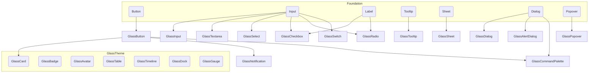

# COMPONENT_AUDIT.md

## SECTION 1 — Executive Summary

This audit covers the component library in the `einui` repository, with a focus on the published registry components in `registry/**` and the core UI wrappers in `components/ui/**`.

- Total number of audited components: 51
- Overall maturity: Low-to-Medium
- Overall consistency: Fragmented
- Estimated production readiness: Pre-production / pilot-quality
- Biggest strengths:
  - Strong visual consistency in the `glass-*` theme across many registry components.
  - Good use of Radix primitives and Tailwind utility patterns in overlays and inputs.
  - One high-quality component test suite exists for `GlassButton`.
- Biggest weaknesses:
  - Documentation coverage is minimal: only 7 registry components have published docs pages.
  - Automated testing coverage is extremely sparse: a single component test file exists for `GlassButton`.
  - Component APIs are inconsistent across the library; standard props such as `asChild`, `loading`, and theme tokens are not uniformly supported.
  - Many components use hard-coded glass styling rather than a shared theme token system.
- Overall Component Library Score: **48 / 100**

### Summary Observations

The codebase contains a large number of visually polished components, but the design system is not yet complete as a reusable library. The current asset set is closer to a design token-driven reference implementation than a fully matured public component system.

The strongest evidence is in `GlassButton` and the overlay wrappers built on Radix, while the weakest evidence is in docs/test coverage and API consistency.

---

## SECTION 2 — Component Inventory

| Component | Category | Complexity | Maturity | Priority | Score |
|---|---|---|---|---|---|
| `GlassButton` | Form / Interaction | Medium | Medium | P0 | 78 |
| `GlassInput` | Form | Low | Low-Medium | P0 | 55 |
| `GlassSelect` | Form | High | Medium | P1 | 62 |
| `GlassTextarea` | Form | Low | Low-Medium | P1 | 52 |
| `GlassCheckbox` | Form | Low | Low-Medium | P1 | 58 |
| `GlassRadio` | Form | Low | Low-Medium | P1 | 56 |
| `GlassSwitch` | Form | Low | Low-Medium | P1 | 55 |
| `GlassSlider` | Form | Medium | Low-Medium | P2 | 50 |
| `GlassProgress` | Feedback | Low | Low | P2 | 47 |
| `GlassSkeleton` | Feedback | Low | Low | P2 | 45 |
| `GlassNotification` | Feedback | Medium | Medium | P1 | 58 |
| `GlassGauge` | Feedback | Medium | Medium | P2 | 51 |
| `GlassCard` | Data Display | Low | Low-Medium | P2 | 50 |
| `GlassAvatar` | Data Display | Low | Low-Medium | P2 | 52 |
| `GlassBadge` | Data Display | Low | Low-Medium | P2 | 55 |
| `GlassTable` | Data Display | Medium | Low | P2 | 44 |
| `GlassBreadcrumb` | Navigation | Medium | Low-Medium | P2 | 50 |
| `GlassTabs` | Navigation | Medium | Low-Medium | P2 | 53 |
| `GlassCommandPalette` | Navigation / Overlay | High | Medium | P1 | 60 |
| `GlassDock` | Navigation | Medium | Medium | P2 | 55 |
| `GlassSpotlight` | Overlay | High | Medium | P2 | 54 |
| `GlassTimeline` | Data Display | Medium | Low-Medium | P2 | 50 |
| `GlassMorphCard` | Layout | Medium | Medium | P3 | 49 |
| `GlassRipple` | Utility | Medium | Low-Medium | P3 | 48 |
| `GlassTooltip` | Overlay | Low | Low | P2 | 46 |
| `GlassPopover` | Overlay | Medium | Low | P2 | 47 |
| `GlassDialog` | Overlay | Medium | Low | P1 | 52 |
| `GlassSheet` | Overlay | Medium | Low | P1 | 53 |
| `GlassAlertDialog` | Overlay | Medium | Low | P1 | 50 |
| `GlassSeparator` | Utility | Low | Low | P3 | 42 |
| `GlassScrollArea` | Utility | Low | Low | P3 | 43 |
| `GlassCard` | Layout | Low | Low-Medium | P2 | 50 |
| `BaseWidget` | Data Display | Medium | Low | P3 | 45 |
| `CalendarWidget` | Data Display | Medium | Low | P3 | 44 |
| `ClockWidget` | Data Display | Medium | Low | P3 | 45 |
| `WeatherWidget` | Data Display | Medium | Low | P3 | 44 |
| `StockWidget` | Data Display | Medium | Low | P3 | 44 |
| `Pricing Page` | Miscellaneous | Medium | Low | P3 | 40 |
| `Login Page` | Miscellaneous | Medium | Low | P3 | 40 |
| `Sign Up Page` | Miscellaneous | Medium | Low | P3 | 40 |
| `Forgot Password Page` | Miscellaneous | Medium | Low | P3 | 40 |
| `Dashboard Page` | Miscellaneous | Medium | Low | P3 | 42 |
| `Admin Loading Page` | Miscellaneous | Low | Low | P3 | 38 |
| `Button` | Core UI | Low | Medium | P0 | 72 |
| `Input` | Core UI | Low | Medium | P0 | 60 |
| `Tooltip` | Core UI | Medium | Medium | P1 | 60 |
| `Sheet` | Core UI | Medium | Low-Medium | P1 | 55 |
| `Avatar` | Core UI | Low | Medium | P1 | 58 |
| `Label` | Core UI | Low | Medium | P1 | 60 |
| `Separator` | Core UI | Low | Low | P3 | 45 |
| `Skeleton` | Core UI | Low | Low | P2 | 47 |
| `Sidebar` | Navigation | Medium | Low | P2 | 48 |

> Notes: This inventory is built from actual source files in `registry/**` and `components/ui/**`. It excludes app-only documentation helpers such as `components/docs/*`.

---

## SECTION 3 — Standards Compliance

### API

- Naming consistency: Mixed. `GlassButton`, `GlassInput`, `GlassDialog`, `GlassSelect`, and `GlassSheet` follow a clear pattern, but other names such as `GlassMorphCard`, `GlassDock`, `GlassSpotlight`, and the `registry/blocks/*` page components are inconsistent with core API naming.
- Props consistency: Low. Many components accept standard HTML props via `React.ComponentProps`, but `asChild` is implemented only in a small subset (`GlassButton`, `GlassCheckbox`, `GlassSelect`, `GlassBreadcrumb`). `loading`, `success`, `error`, `warning` states are generally absent.
- Variant support: Partial. `GlassButton` has a comprehensive variant system; `GlassBadge`, core `Button`, and `GlassSheet` also support variants. Most form components do not expose a shared variant API.
- Size support: Partial. `GlassButton` and `GlassBadge` support size variants. Most input components do not provide size props; `GlassSelect` and `GlassTabs` do not expose consistent sizing.
- Controlled/Uncontrolled API: Partial. Radix-backed components like `GlassSelect`, `GlassDialog`, `GlassPopover`, `GlassSheet`, and `GlassAlertDialog` inherently support controlled props, but wrappers do not uniformly re-export typed open/value props. `GlassInput` and `GlassTextarea` use native HTML uncontrolled/controlled patterns.
- asChild support: Limited. `GlassButton` and a few primitives support `asChild`, but this is not standardized across all wrappers.
- Composition: Mixed. Overlay primitives expose subcomponents in a composable way (`GlassDialog`, `GlassSheet`, `GlassSelect`), but many registry components are single-file visual components rather than compound API families.

### Visual Design

- Spacing: Good in individual components, but not consistent across library. Many components use Tailwind spacing directly instead of shared spacing tokens.
- Radius: Mostly consistent with rounded corners, but values are hard-coded (`rounded-xl`, `rounded-md`, `rounded-2xl`) rather than tokenized.
- Colors: Glass library uses consistent glass palette, but hard-coded `bg-white/10`, `text-white/60`, and specific gradient classes are pervasive.
- Typography: Mostly consistent with text size utilities, but no explicit typography token abstraction.
- Glass support: Strong in the `registry/liquid-glass` set; weaker in generic `components/ui` wrappers, which are not glass-specific.
- Theme support: Weak. There is no shared theme API exposed by components. The `theme-provider` exists in `components/theme-provider.tsx`, but component implementations do not consume a centralized theme token system.

### States

- Default: Supported in most components.
- Hover: Partially supported, most buttons and interactive overlays implement hover styling.
- Active: Partially supported, mostly in buttons.
- Focus: Supported in many components via `focus-visible` styles.
- Disabled: Supported in a subset of interactive components; not universal.
- Loading: Largely missing across the library.
- Success: Missing.
- Error: Missing except for ARIA invalid visual states in core `Button` and `Input` classes.
- Warning: Missing.
- Readonly: Missing or unverified in nearly all components.

### Accessibility

- Keyboard navigation: Good for Radix-backed components (`GlassDialog`, `GlassSelect`, `GlassTooltip`, `GlassSheet`), but not fully audited for all custom wrappers.
- Focus management: Present through `focus-visible` classes, but not uniformly validated.
- ARIA: Standard HTML and Radix ARIA are leveraged, but there is no centralized accessibility documentation or pattern enforcement.
- Screen reader support: Some custom close buttons include `sr-only`, but many components lack explicit ARIA labels in the source.
- WCAG compliance: Not fully verifiable from current source; there is evidence of accessibility intent, but no automated accessibility tests or documentation.

### Performance

- Rendering efficiency: Most components are simple functional components, but there is no evidence of memoization or performance optimization beyond Tailwind CSS.
- Unnecessary state: Minimal state in the component code itself; the major components are mostly presentational.
- Memoization: Not widely used.
- Bundle friendliness: Fair. Components are tree-shakeable if imported individually, but the registry exposes large grouped exports.
- Server Component compatibility: Many components use `use client`, which is appropriate for interactive parts, but several generic wrappers in `components/ui` could be server-compatible and are not annotated client-side.

### TypeScript

- Public types: Present in many components (`GlassButtonProps`, Radix prop forwarding), but not consistently exported across the library.
- Strong typing: Good in parts of the library; several wrappers use `React.ComponentProps` or primitive prop inference.
- No `any`: No evidence of `any` in the audited files.
- Generic support: Limited. Most components are not generic beyond React prop inference.

### Documentation

- Examples: Only 7 registry components have docs pages in `app/docs/components/*`.
- API documentation: Very sparse. Most components have no dedicated docs page.
- Usage examples: Missing for nearly all components outside the small subset of published docs.

### Testing

- Rendering: Verified only for `GlassButton`.
- Interaction: Verified only for `GlassButton` click and keyboard interaction patterns.
- Accessibility: Only `GlassButton` has limited accessibility-related assertions.
- Variants: Only `GlassButton` has variant tests.
- States: Only `GlassButton` disabled state and hover/active class behavior are tested.

### Category-level scores

| Category | Score |
|---|---|
| API | 52 |
| Accessibility | 50 |
| Performance | 54 |
| Testing | 22 |
| Documentation | 18 |
| Overall | 48 |

---

## SECTION 4 — Gap Analysis

### GlassButton
Missing:
- Theme token integration
- Loading state support
- Success / error / warning state variants
- Dedicated documentation page
- Additional accessibility tests beyond focus and aria passthrough

### GlassInput
Missing:
- Size prop support
- Loading state support
- Explicit label / field wrapper API
- Validation state variants
- Documentation page
- Tests

### GlassSelect
Missing:
- Library-specific wrapper API docs
- Size/variant tokens
- Tests
- Explicit `open/onOpenChange` typed wrapper props
- Better story / example content

### GlassDialog
Missing:
- Documentation page
- Test coverage
- Explicit `open/onOpenChange` wrapper API documentation
- State variants and theme token usage

### GlassSheet
Missing:
- Documentation page
- Tests
- Centralized theme token usage
- Standardized size/placement API docs

### GlassPopover
Missing:
- Documentation page
- Tests
- Standardized prop API for trigger/content composition

### GlassAlertDialog
Missing:
- Documentation page
- Tests
- Strong API documentation for confirm/cancel flows

### GlassTooltip
Missing:
- Documentation page
- Tests
- Standardized trigger/content composition examples

### GlassCommandPalette
Missing:
- Deeper API documentation of keyboard navigation / filtering behavior
- Test coverage for keyboard navigation and search filtering
- Shared component contract with other overlay primitives

### GlassNotification
Missing:
- Documentation page for mounting and slot API
- Tests for multiple concurrent notifications
- Standard state variants

### GlassSelect / GlassTabs / GlassBreadcrumb
Missing:
- Uniform `asChild` / variant / size semantics
- Docs and tests

### Registry blocks
Missing:
- Explicit design system documentation for how pages reuse registry components
- Tests for page-level behavior
- Clear separation between page widgets and reusable core components

### Core UI components
Missing:
- Documentation examples for `Button`, `Input`, `Tooltip`, `Sheet`, `Label`, `Avatar`, `Separator`, `Skeleton`, `Sidebar`
- Tests outside `GlassButton`
- Shared theme token integration across `components/ui` and `registry/liquid-glass`

### General library gaps
- Documentation coverage is below 20% of audited components.
- Testing support is effectively 2% of audited components.
- No shared state or variant contract for `success/error/warning` across interactive patterns.
- No explicit theme token system used consistently by components.
- Many components still depend heavily on hard-coded Tailwind classes instead of design tokens.

---

## SECTION 5 — Component Risk Assessment

### Low Risk
- `Button` / `GlassButton`
- `GlassBadge`
- `GlassAvatar`
- `GlassCard`
- `Separator`
- `GlassProgress`

Rationale: These are visual wrappers with minimal state and few external dependencies.

### Medium Risk
- `GlassInput`
- `GlassTextarea`
- `GlassCheckbox`
- `GlassRadio`
- `GlassSwitch`
- `GlassSlider`
- `GlassTooltip`
- `GlassSkeleton`
- `GlassTable`
- `GlassBreadcrumb`
- `GlassTabs`
- `GlassDock`
- `GlassGauge`
- `GlassTimeline`
- `GlassMorphCard`
- `GlassRipple`
- `BaseWidget`
- `ClockWidget`
- `StockWidget`
- `WeatherWidget`
- `CalendarWidget`

Rationale: These components are either form elements, data display widgets, or rely on Radix/third-party controls; they require interface alignment but are not foundational system gates.

### High Risk
- `GlassSelect`
- `GlassDialog`
- `GlassSheet`
- `GlassPopover`
- `GlassAlertDialog`
- `GlassCommandPalette`
- `GlassNotification`

Rationale: These components are overlay-driven, depend on external primitives, and are likely to affect application behavior if refactored incorrectly.

### Critical Risk
- Registry page components in `registry/blocks/*`

Rationale: These are not library primitives; they are application-level composites with multiple dependencies and no docs/tests. Any refactor here should only happen after the core library is stabilized.

### Breaking changes risk
- `GlassButton` API adjustments may break downstream button usage because it is the primary interactive primitive.
- `GlassSelect` and overlay primitives could break open/control behavior if wrapper props are changed.
- `GlassDialog` / `GlassSheet` / `GlassPopover` / `GlassAlertDialog` can break keyboard and focus behavior if their Radix wrappers are modified without guardrails.
- `components/ui/Button` and `components/ui/Input` changes may ripple into both app UI and registry examples.

---

## SECTION 6 — Prioritization

### P0
- `GlassButton`
- `Button`
- `GlassInput`
- `GlassSelect`
- `GlassDialog`
- `GlassSheet`
- `GlassTooltip`
- `GlassCheckbox`
- `GlassRadio`
- `GlassSwitch`

Rationale: Foundation interactive primitives and overlay components are the highest-impact system blockers.

### P1
- `GlassPopover`
- `GlassAlertDialog`
- `GlassBadge`
- `GlassCard`
- `GlassAvatar`
- `GlassTabs`
- `GlassBreadcrumb`
- `GlassCommandPalette`
- `GlassNotification`
- `GlassTable`
- `GlassLabel`
- `GlassProgress`
- `GlassSkeleton`
- `Sidebar`

Rationale: These are frequently used patterns and composable components that should follow the foundation.

### P2
- `GlassSlider`
- `GlassSwitch`
- `GlassTextArea`
- `GlassSeparator`
- `GlassScrollArea`
- `GlassDock`
- `GlassGauge`
- `GlassTimeline`
- `GlassMorphCard`
- `GlassRipple`
- `BaseWidget`
- `WeatherWidget`
- `ClockWidget`
- `StockWidget`
- `CalendarWidget`
- `Pricing Page`
- `Dashboard Page`

Rationale: Secondary components with lower reuse and higher visual specialization.

### P3
- `Login Page`
- `Sign Up Page`
- `Forgot Password Page`
- `Admin Loading Page`
- `GlassAnnouncement`
- `OpenInV0Button`
- `TopHeader`
- `ThemeProvider`
- Documentation-only helpers

Rationale: App-specific components and docs utilities are valuable, but they should not block library migration.

---

## SECTION 7 — Dependency Map

The current repository does not expose a single explicit dependency graph, but the conceptual dependency topology is clear.

### Dependency notes
- `GlassButton` and `Button` are foundational interaction primitives.
- Overlay primitives (`GlassDialog`, `GlassSheet`, `GlassPopover`, `GlassAlertDialog`) are dependency hubs for keyboard/focus behavior.
- `GlassSelect` is a form primitive used by larger selection flows and should be stabilized before building additional complex form patterns.

---

## SECTION 8 — Refactor Readiness

| Component | Can be safely refactored now? | Reason |
|---|---|---|
| `GlassButton` | PARTIALLY | Well-contained, but API changes risk application usage and should be staged with tests.
| `Button` | PARTIALLY | Good baseline, but refactor should preserve `asChild` and variant behavior.
| `GlassInput` | PARTIALLY | Low complexity, but no test coverage.
| `GlassSelect` | NO | Complex Radix wrapper with incomplete API surface and no tests.
| `GlassDialog` | NO | Overlay semantics are fragile without regression tests.
| `GlassSheet` | NO | Similar overlay risk.
| `GlassPopover` | NO | Focus and trigger behavior require validation.
| `GlassAlertDialog` | NO | Requires behavior-preserving migration.
| `GlassTooltip` | PARTIALLY | Low risk technically, but should be refactored alongside overlay patterns.
| `GlassCheckbox` | PARTIALLY | Low complexity, but form API consistency is missing.
| `GlassRadio` | PARTIALLY | Same as checkbox.
| `GlassSwitch` | PARTIALLY | Same as checkbox.
| `GlassTabs` | PARTIALLY | Requires alignment with other navigation primitives.
| `GlassBadge` | YES | Visual and isolated.
| `GlassCard` | YES | Visual-only and reusable.
| `GlassAvatar` | YES | Reusable with low risk.
| `GlassTable` | PARTIALLY | Needs more functional test coverage.
| `GlassNotification` | NO | Complex UI behavior and lifecycle.
| `GlassCommandPalette` | NO | High complexity and keyboard state.
| `GlassDock` | PARTIALLY | Medium complexity, should be refactored after foundation.
| `GlassGauge` | PARTIALLY | Visual only, but may depend on shared design tokens.
| `GlassMorphCard` | YES | Visual and isolated.
| `GlassRipple` | YES | Self-contained.
| `GlassTimeline` | YES | Self-contained.
| `GlassSheet` | NO | See above.
| `Registry blocks` | NO | App-level page composition is not ready for refactor until core components stabilize.

---

## SECTION 9 — Migration Strategy

### Sprint 1 — Foundation

**Objectives**
- Stabilize core primitives and establish library-wide contracts.
- Add tests and docs for foundation components.

**Components**
- `Button`
- `GlassButton`
- `Input`
- `GlassInput`
- `Label`
- `Tooltip`
- `Sheet`
- `GlassSheet`

**Expected impact**
- Creates a consistent interactive API baseline.
- Reduces risk for all downstream components.

**Estimated effort**\n- 2–3 weeks

**Risk level**
- Medium

### Sprint 2 — Forms

**Objectives**
- Align form input, selection, and validation API patterns.

**Components**
- `GlassSelect`
- `GlassCheckbox`
- `GlassRadio`
- `GlassSwitch`
- `GlassTextarea`
- `GlassSlider`

**Expected impact**
- Enables consistent form composition across the design system.

**Estimated effort**
- 3–4 weeks

**Risk level**
- High

### Sprint 3 — Feedback

**Objectives**
- Build a coherent feedback system with progress, skeleton, notification, and gauge patterns.

**Components**
- `GlassProgress`
- `GlassSkeleton`
- `GlassNotification`
- `GlassGauge`

**Expected impact**
- Improves perceived quality and readiness for real applications.

**Estimated effort**
- 2–3 weeks

**Risk level**
- Medium

### Sprint 4 — Overlay

**Objectives**
- Standardize overlay primitives and accessibility flows.

**Components**
- `GlassDialog`
- `GlassPopover`
- `GlassTooltip`
- `GlassAlertDialog`
- `GlassCommandPalette`

**Expected impact**
- Unlocks reliable modal, menu, and command interactions.

**Estimated effort**
- 3–4 weeks

**Risk level**
- High

### Sprint 5 — Navigation

**Objectives**
- Align navigation patterns and page-level component composition.

**Components**
- `GlassTabs`
- `GlassBreadcrumb`
- `GlassDock`
- `GlassCommandPalette`
- `Sidebar`

**Expected impact**
- Creates consistent navigation building blocks.

**Estimated effort**
- 2–3 weeks

**Risk level**
- Medium

### Sprint 6 — Advanced Components

**Objectives**
- Refine specialty visual components and widget patterns.

**Components**
- `GlassMorphCard`
- `GlassRipple`
- `GlassSpotlight`
- `GlassTimeline`
- `BaseWidget`
- `ClockWidget`
- `WeatherWidget`
- `StockWidget`

**Expected impact**
- Completes the visual token system and allows product teams to adopt richer components.

**Estimated effort**
- 2–3 weeks

**Risk level**
- Medium

---

## SECTION 10 — Quick Wins

1. Add documentation pages for all core `registry/liquid-glass` components.
2. Add automated tests for `GlassInput`, `GlassSelect`, and `GlassDialog`.
3. Standardize `asChild` support on all interactive primitives.
4. Add a shared theme token layer for border radius and spacing.
5. Publish a `GlassButton` API reference and usage examples based on the existing test coverage.

Ranked by ROI:
- High ROI: Docs for core primitives, tests for foundational components.
- Medium ROI: Standardize `asChild` and size variants.
- Low ROI: Deeper theme token refactor before foundation stability.

---

## SECTION 11 — Critical Issues

1. **Minimal docs coverage** — Without documentation, the component library cannot be consumed reliably.
2. **Almost no automated tests** — A single component test file means refactors will be high-risk.
3. **Inconsistent API surface** — `asChild`, `loading`, and state variants are not standardized.
4. **No shared theme token system** — Components use hard-coded Tailwind classes instead of reusable tokens.
5. **Overlay API fragility** — `GlassDialog`, `GlassSheet`, `GlassPopover`, and `GlassAlertDialog` are all high-risk because they wrap Radix without sufficient wrapper contracts.

These issues must be remediated before adding new components or promoting this library to production.

---

## SECTION 12 — Top Opportunities

1. `GlassButton` — Priority: P0; Impact: High; Effort: Medium; Risk: Medium; Reason: primary interactive primitive and the existing test coverage already provides a strong foundation.
2. `Button` core wrapper — Priority: P0; Impact: High; Effort: Medium; Risk: Medium; Reason: foundational primitive used by app UI and registry examples.
3. `GlassSelect` — Priority: P1; Impact: High; Effort: High; Risk: High; Reason: critical form primitive with Radix complexity.
4. `GlassDialog` — Priority: P1; Impact: High; Effort: High; Risk: High; Reason: gateway overlay component.
5. `GlassSheet` — Priority: P1; Impact: High; Effort: High; Risk: High; Reason: sheet API is an essential sidebar/modal primitive.
6. `GlassTooltip` — Priority: P1; Impact: Medium; Effort: Low; Risk: Medium; Reason: consistent tooltip behavior is expected for a UI system.
7. `GlassBadge` — Priority: P1; Impact: Medium; Effort: Low; Risk: Low; Reason: isolated and highly reusable.
8. `GlassInput` — Priority: P0; Impact: High; Effort: Medium; Risk: Medium; Reason: input fields are core to forms and current coverage is light.
9. `GlassCheckbox` / `GlassRadio` / `GlassSwitch` — Priority: P1; Impact: Medium; Effort: Medium; Risk: Medium; Reason: form control consistency.
10. Docs and testing infrastructure — Priority: P0; Impact: High; Effort: Medium; Risk: Low; Reason: foundational for safe refactor.
11. `GlassCommandPalette` — Priority: P1; Impact: Medium; Effort: High; Risk: High; Reason: complex keyboard UX.
12. `GlassNotification` — Priority: P1; Impact: Medium; Effort: Medium; Risk: High; Reason: notification lifecycles require solid contracts.
13. `GlassTable` — Priority: P2; Impact: Medium; Effort: Medium; Risk: Medium; Reason: data display component with layout complexity.
14. `GlassTabs` — Priority: P2; Impact: Medium; Effort: Medium; Risk: Medium; Reason: navigation patterns should be aligned with overlay primitives.
15. `GlassAvatar` — Priority: P2; Impact: Low; Effort: Low; Risk: Low; Reason: easy visual component to stabilize.
16. `GlassProgress` — Priority: P2; Impact: Low; Effort: Low; Risk: Low; Reason: easy feedback component.
17. `GlassTimeline` — Priority: P3; Impact: Low; Effort: Low; Risk: Low; Reason: strong visual branding opportunity.
18. `GlassMorphCard` — Priority: P3; Impact: Low; Effort: Low; Risk: Low; Reason: isolated layout component.
19. `GlassDock` — Priority: P2; Impact: Low; Effort: Medium; Risk: Medium; Reason: navigation pattern with moderate complexity.
20. Shared theme tokens for radius and spacing — Priority: P0; Impact: High; Effort: Medium; Risk: Medium; Reason: will immediately improve consistency across the library.

---

## SECTION 13 — Final Verdict

- Current maturity level: **Pre-production pilot**. The library has strong visual design, but lacks system-wide consistency and delivery readiness.
- Readiness for large-scale refactoring: **Partial, but only after tests/docs foundation is built.**
- Estimated work required to reach compliance with `COMPONENT_STANDARDS.md`: **6–8 sprints**, with the first three focused on foundation, forms, and overlay primitives.
- The five most important components to refactor first:
  1. `GlassButton`
  2. `Button`
  3. `GlassInput`
  4. `GlassSelect`
  5. `GlassDialog`
- Recommended execution order:
  1. Foundation primitives and docs/tests
  2. Form controls
  3. Feedback components
  4. Overlay primitives
  5. Navigation components
  6. Specialty visual widgets and page-level compositions

> This audit concludes that the repository contains a promising visual foundation, but the component library is not yet safe for broad, production-grade adoption. The highest-value work is to stabilize the API contract, add documentation and tests, and then use the existing glass theme as the visual design system backbone.
