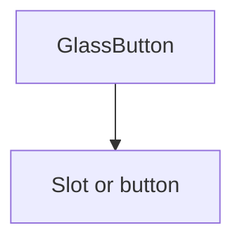

## SECTION 1 — Executive Summary
- **Purpose:** Primary glass-themed action trigger.
- **Maturity:** Medium.
- **Audit score:** **78/100**.
- **Why refactor:** Current API diverges from system standards (`glowEffect`, `size="default"`), hardcoded visual values, missing standardized states (`loading/success/warning`).
- **Expected outcome:** Token-driven, standards-aligned, fully documented button primitive with stable migration path.

## SECTION 2 — Current Problems
- **API:** `glowEffect` is custom; no standardized `loading`; no explicit default `type`.
- **Visual:** Hardcoded gradients/shadows/blur classes; extra wrapper `div` always rendered.
- **A11y:** No built-in loading semantics (`aria-busy`), no icon-only labeling guidance.
- **Performance:** Optional glow uses extra layer; unnecessary wrapper in all cases.
- **States/variants:** Missing `success`, `warning`, `info`, `soft`, `glass` naming alignment.
- **Technical debt:** Glass styling logic embedded directly in component.

## SECTION 3 — Refactor Goals (Priority)
1. Standardize API to COMPONENT_STANDARDS.md.
2. Add complete interactive/accessibility state model.
3. Tokenize visual system (no hardcoded style values).
4. Preserve backward compatibility (`glowEffect` alias).
5. Improve docs/tests completeness.

## SECTION 4 — Public API
- **Props:** `variant`, `size`, `disabled`, `loading`, `asChild`, `type`, `className`, `children`.
- **Variants target:** `default|secondary|outline|ghost|soft|glass|destructive|success|warning|info|link`.
- **Sizes target:** `xs|sm|md|lg|xl|icon`.
- **Theme:** `theme?: "default" | "glass"` (future-ready; default glass for this component).
- **Events:** Native button events pass-through.
- **Controlled/Uncontrolled:** N/A (action component).
- **Defaults:** `variant="glass"`, `size="md"`, `type="button"`, `loading=false`.
- **Deprecated:** `glowEffect` → `glow`.
- **Removed (next major):** `primary` alias, `size="default"` alias.
- **Reasoning:** Align with library-wide contracts and reduce one-off semantics.

## SECTION 5 — Component States
Support: **default, hover, active, focus-visible, disabled, loading, success, error/destructive, warning, selected(aria-pressed), pending**.
Each state must define:
- visual token mapping,
- interaction lock policy (e.g., loading => non-interactive),
- accessibility semantics (`aria-busy`, `aria-disabled`, label persistence).

## SECTION 6 — Composition Model
- Remains **standalone primitive** with `asChild` polymorphism.
- No compound children required.
- No internal context required.

## SECTION 7 — Accessibility Requirements
- Keyboard: `Enter/Space` activate.
- Focus: consistent focus ring token.
- ARIA: `aria-busy` on loading, `aria-disabled` for non-native polymorphic targets.
- SR: icon-only usage requires `aria-label`.
- Motion: respect `prefers-reduced-motion`.
- WCAG: contrast + visible focus must satisfy AA.
- **Acceptance:** keyboard + SR behavior parity across all variants/states.

## SECTION 8 — Design & Visual Language
- Follow COMPONENT_STANDARDS.md: semantic variants, tokenized radius/spacing/motion.
- Glass behavior via theme tokens (blur/opacity/border/reflection/shadow).
- Light/dark mode parity required.
- Interaction feedback via tokenized transitions only.

## SECTION 9 — Design Tokens
Consume (no hardcoding):
- Color: `color.surface.glass`, `color.text.primary`, semantic status tokens.
- Radius: `radius.sm|md|lg|xl`.
- Spacing: `space.2|3|4|6`.
- Shadow: `shadow.glass.sm|md`, `shadow.focus`.
- Motion: `motion.fast|normal`, easing tokens.
- Typography: `font.size.sm|md`, `font.weight.medium`.
- Glass: `glass.blur`, `glass.opacity.surface`, `glass.opacity.border`.

## SECTION 10 — Performance Considerations
- Remove unnecessary wrapper when `glow=false`.
- Keep class generation static (`cva`) and deterministic.
- Preserve tree-shakeable export.
- SSR/RSC-safe output; avoid hydration-variant drift.

## SECTION 11 — Breaking Changes
- `glowEffect` renamed to `glow` (compat alias in transition).
- `size="default"` → `size="md"` canonical.
- Variant `primary` deprecated in favor of standards-compliant mapping.
- Migration risk: medium (widely used in blocks/pages).

## SECTION 12 — Test Plan
- Rendering: all variants/sizes.
- Interaction: click, disabled, loading lock.
- Keyboard: Enter/Space/focus-visible.
- A11y: `aria-busy`, icon-only label.
- Regression: `asChild` semantics and class composition.

## SECTION 13 — Documentation Requirements
Examples required: basic, variants, sizes, states, async loading, accessibility, `asChild`, migration notes (`glowEffect`, `primary`, `default` size).

## SECTION 14 — Acceptance Criteria
Complete only when:
- standards-compliant API,
- all audit findings for button resolved,
- token-driven styles,
- full state coverage + docs + tests,
- no undocumented behavior.

## SECTION 15 — Refactor Checklist
- □ Normalize variants/sizes to standards  
- □ Add loading/pending semantics  
- □ Add status variants  
- □ Tokenize all styling  
- □ Preserve compatibility aliases  
- □ Expand a11y + regression tests  
- □ Update docs + migration notes

## SECTION 16 — Future Opportunities
- Unify with core `Button` via `theme="glass"` instead of dedicated component.
- Add `ButtonGroup` and loading text slot.
- Add analytics-safe action instrumentation pattern.
