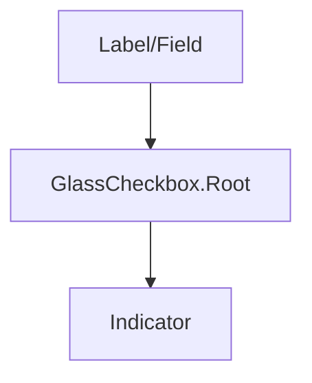

## SECTION 1 — Executive Summary
- **Purpose:** Glass-themed checkbox control.
- **Maturity:** Low-Medium.
- **Audit score:** **58/100**.
- **Why refactor:** Uses animated indicator and optional label, but lacks standardized sizes/variants/status and has fragile default id behavior.
- **Expected outcome:** Form-system-consistent checkbox API with accessible labeling and status states.

## SECTION 2 — Current Problems
- Default `id` fallback is static (`glass-checkbox-id`) and can collide.
- Uses custom `label` prop instead of composition-first field pattern.
- No standardized size/status/variant API.
- Hardcoded styles + framer-motion timings.

## SECTION 3 — Refactor Goals (Priority)
1. Fix ID/label robustness.
2. Standardize API with form control conventions.
3. Tokenize visuals/motion.
4. Improve docs/tests for form accessibility.

## SECTION 4 — Public API
- Root props: controlled (`checked/onCheckedChange`) + uncontrolled (`defaultChecked`).
- Add `size`, `variant`, `status`, `disabled`, `required`, `invalid`.
- Replace `label` prop with composition guidance (`Label`/Field).
- Deprecate inline `label` prop (transition support).

## SECTION 5 — Component States
Unchecked/checked/indeterminate, hover/focus/active/disabled/readonly/error/success/warning/pending.

## SECTION 6 — Composition Model
- Keep primitive + indicator.
- Prefer external label composition.

## SECTION 7 — Accessibility Requirements
- Proper label association required.
- Indeterminate semantics supported.
- Keyboard toggle via Space.
- `aria-invalid`, `aria-required`, `aria-describedby` support.

## SECTION 8 — Design & Visual Language
Tokenized control size, border/fill, indicator motion, focus rings, glass consistency.

## SECTION 9 — Design Tokens
Control size/status/focus/motion/shadow/glass tokens.

## SECTION 10 — Performance Considerations
Keep indicator animation lightweight; avoid unnecessary motion on state sync.

## SECTION 11 — Breaking Changes
`label` prop deprecation and ID behavior changes may affect existing usage.

## SECTION 12 — Test Plan
Controlled/uncontrolled, keyboard toggle, indeterminate, label click, status/disabled states, a11y assertions.

## SECTION 13 — Documentation Requirements
Form examples, indeterminate patterns, validation states, accessibility caveats.

## SECTION 14 — Acceptance Criteria
Checkbox aligns with standards and form primitives, with robust a11y and migration guidance.

## SECTION 15 — Refactor Checklist
- □ Remove static ID fallback behavior  
- □ Deprecate `label` prop  
- □ Add size/status tokens  
- □ Add comprehensive tests/docs

## SECTION 16 — Future Opportunities
Group-level helper APIs, “select all” pattern utilities.
