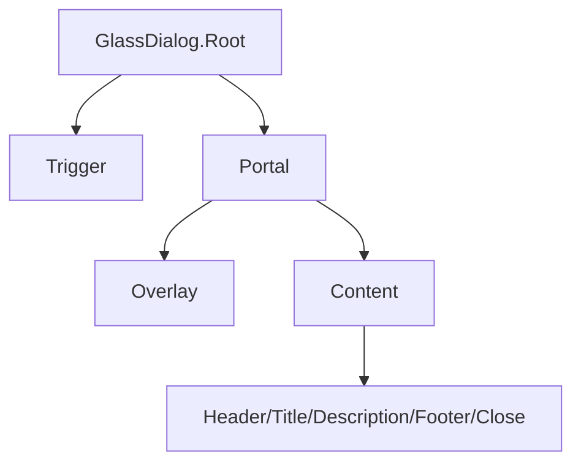

## SECTION 1 — Executive Summary
- **Purpose:** Glass-themed modal dialog system.
- **Maturity:** Low.
- **Audit score:** **52/100**.
- **Why refactor:** Composable wrapper exists, but no standardized API contract docs, state/variant system, or test safety net.
- **Expected outcome:** Stable overlay primitive with explicit lifecycle and accessibility contract.

## SECTION 2 — Current Problems
- Hardcoded overlay/content visual classes.
- No standardized variant/size/theming API.
- Close button behavior present but not configurable contractually.
- Controlled APIs available through Radix but undocumented in component-level guidance.
- No formal loading/pending/confirm states model for action dialogs.

## SECTION 3 — Refactor Goals (Priority)
1. Lock behavioral contract (`open`, focus trap, close semantics).
2. Standardize visual API for size/variant/theme.
3. Add robust accessibility and interaction test coverage.
4. Tokenize styling.

## SECTION 4 — Public API
- Root: `open`, `defaultOpen`, `onOpenChange`, `modal`.
- Content: `size`, `variant`, `theme`, `showClose`, `closeLabel`.
- Structural parts retained: Header/Footer/Title/Description/Trigger/Close.
- Controlled/uncontrolled both first-class.
- Future: confirm/cancel patterns as non-breaking utilities.

## SECTION 5 — Component States
Closed/opening/open/closing/focus-trapped/disabled-actions/loading/pending/error/success contexts for action footers.

## SECTION 6 — Composition Model
- Compound component architecture remains.
- Shared open state context inherited from Radix root.

## SECTION 7 — Accessibility Requirements
- Focus trap + restore on close.
- `Esc` close behavior configurable.
- Proper dialog role, labelledby/describedby.
- Screen-reader-friendly close action text.
- Reduced-motion animations for open/close.

## SECTION 8 — Design & Visual Language
- Overlay opacity/blur tokens.
- Content radius/shadow/spacing typography tokens.
- Dark/light parity with glass token system.
- Consistent motion curves with other overlays.

## SECTION 9 — Design Tokens
Overlay/background/content/border/shadow/radius/spacing/typography/focus/motion/glass tokens.

## SECTION 10 — Performance Considerations
- Portal mount/unmount cost awareness.
- Keep animation class branches deterministic.
- SSR-safe with client boundary where required.

## SECTION 11 — Breaking Changes
- Canonical size/variant API introduction.
- Potential class customization migration if consumers target internals.

## SECTION 12 — Test Plan
Open/close lifecycle, keyboard trap, focus restore, `Esc`, click outside behavior, accessibility roles/labels, variant snapshots.

## SECTION 13 — Documentation Requirements
Basic modal, controlled modal, destructive confirm flow, accessibility notes, compositional best practices.

## SECTION 14 — Acceptance Criteria
Dialog becomes reliable overlay baseline with full accessibility and migration-safe API.

## SECTION 15 — Refactor Checklist
- □ Define explicit root/content APIs  
- □ Tokenize visuals  
- □ Add overlay behavior tests  
- □ Add a11y acceptance suite  
- □ Publish docs + migration notes

## SECTION 16 — Future Opportunities
- Stacked dialog manager, async close guards, cross-overlay orchestration APIs.
