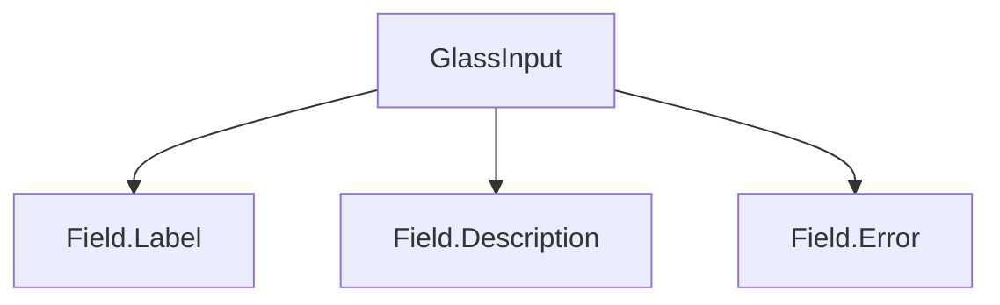

## SECTION 1 — Executive Summary
- **Purpose:** Glass-themed text input primitive.
- **Maturity:** Low-Medium.
- **Audit score:** **55/100**.
- **Why refactor:** Missing size/validation/loading APIs; hardcoded glass styling; limited accessibility contract.
- **Expected outcome:** Tokenized, field-system-ready input with predictable API.

## SECTION 2 — Current Problems
- Custom prop `glowOnFocus`; no shared theme prop.
- No `size`/`variant` system.
- Missing standardized states (`error/success/warning/loading/readonly`).
- Hardcoded glass classes and glow layer.
- No built-in field composition model (`label`, `description`, `error`).

## SECTION 3 — Refactor Goals (Priority)
1. Standardize API with semantic variant/size/state.
2. Add validation and readonly/loading patterns.
3. Improve form composition compatibility.
4. Tokenize all visuals.

## SECTION 4 — Public API
- `variant?: default|outline|ghost|soft|glass|destructive|success|warning|info`
- `size?: xs|sm|md|lg|xl`
- `status?: none|success|error|warning`
- `loading?: boolean`
- `readonly?: boolean`
- Native input props pass-through.
- Deprecated: `glowOnFocus`.
- Future: `Field` compound integration hooks.

## SECTION 5 — Component States
Must support default/hover/focus/disabled/readonly/loading/error/success/warning/pending with explicit visual and ARIA behavior (`aria-invalid`, `aria-busy`, `aria-describedby`).

## SECTION 6 — Composition Model
- Standalone primitive now.
- Must compose cleanly with future `Field` wrapper and slot props.

## SECTION 7 — Accessibility Requirements
- Label association required (`id` + `htmlFor`).
- Error state uses `aria-invalid` and error description IDs.
- Keyboard/tab order default native behavior preserved.
- Touch target + focus contrast compliant.

## SECTION 8 — Design & Visual Language
- Input density via size tokens.
- Glass surface tokens for background/border/shadow.
- Light/dark mode balanced placeholder and content contrast.
- Focus and error rings tokenized.

## SECTION 9 — Design Tokens
Surface/border/text/placeholder/status/focus tokens, spacing + radius + typography + motion + glass blur/opacity tokens.

## SECTION 10 — Performance Considerations
- Avoid animated wrappers unless enabled.
- Keep uncontrolled/controlled parity without extra effects.
- SSR-safe deterministic class output.

## SECTION 11 — Breaking Changes
- `glowOnFocus` deprecation.
- Canonical size/variant introduction may require class migration.

## SECTION 12 — Test Plan
Rendering, controlled/uncontrolled value behavior, keyboard input, IME safety, status states, readonly/disabled/loading, a11y assertions.

## SECTION 13 — Documentation Requirements
Basic usage, with label/error/help text composition, validation states, loading patterns, accessibility examples.

## SECTION 14 — Acceptance Criteria
Input must meet standards + audit requirements with complete docs/tests and token-only visuals.

## SECTION 15 — Refactor Checklist
- □ Add size/variant/status APIs  
- □ Add readonly/loading states  
- □ Tokenize styles  
- □ Add field composition guidance  
- □ Add test suite + docs

## SECTION 16 — Future Opportunities
- Masking/format adapters, async validation helpers, field-level context hooks.
