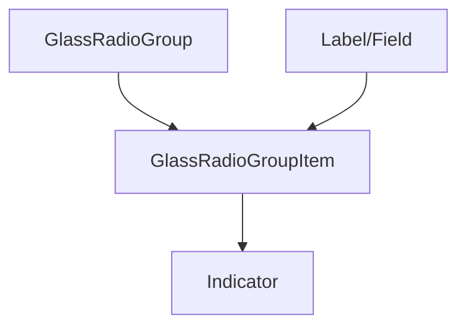

## SECTION 1 — Executive Summary
- **Purpose:** Glass-themed radio group/item controls.
- **Maturity:** Low-Medium.
- **Audit score:** **56/100**.
- **Why refactor:** Good base primitive but lacks standardized status/sizing API and uses inline label prop on item.
- **Expected outcome:** Fully standardized radio contract with robust group-level accessibility.

## SECTION 2 — Current Problems
- `label` prop on item mixes concerns.
- No variant/size/status APIs.
- Hardcoded motion/styling values.
- ID fallback uses derived value and may be brittle for duplicate values.

## SECTION 3 — Refactor Goals (Priority)
1. Standardize group/item API.
2. Improve label and ID composition robustness.
3. Tokenize visuals/motion.
4. Add docs/tests for keyboard and group behavior.

## SECTION 4 — Public API
- Group: `value/defaultValue/onValueChange`, `name`, `required`, `disabled`, `orientation`.
- Item: `value`, `disabled`, `size`, `status`, `invalid`.
- Deprecate `label` prop in favor of composed Label/Field usage.

## SECTION 5 — Component States
Unchecked/checked, focused, hovered, disabled, readonly, error/success/warning, pending.

## SECTION 6 — Composition Model
Group + Item + Indicator with external labels.

## SECTION 7 — Accessibility Requirements
- Arrow key navigation within group.
- Proper radio group/name semantics.
- Label association and SR announcement of selected option.
- Invalid/required semantics via ARIA.

## SECTION 8 — Design & Visual Language
Tokenized ring/fill/sizing/motion with glass consistency in both themes.

## SECTION 9 — Design Tokens
Radio control/status/focus/motion/glass tokens.

## SECTION 10 — Performance Considerations
Avoid expensive motion transitions for frequent selection changes.

## SECTION 11 — Breaking Changes
`label` prop deprecation; canonical size/status API introduction.

## SECTION 12 — Test Plan
Group keyboard navigation, selection updates, disabled behavior, label interaction, accessibility.

## SECTION 13 — Documentation Requirements
Group setup, controlled/uncontrolled, validation and accessibility examples.

## SECTION 14 — Acceptance Criteria
Radio aligns with standards, form composition, and accessibility expectations.

## SECTION 15 — Refactor Checklist
- □ Normalize group/item API  
- □ Deprecate inline label prop  
- □ Add status/size support  
- □ Add keyboard/a11y tests

## SECTION 16 — Future Opportunities
Radio cards/tiles built as compositional wrappers over base radio primitives.
