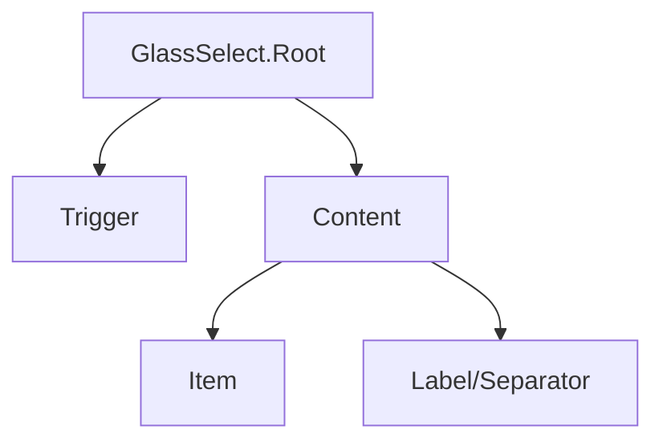

## SECTION 1 — Executive Summary
- **Purpose:** Glass-themed select built on Radix Select.
- **Maturity:** Medium.
- **Audit score:** **62/100**.
- **Why refactor:** Good composition but lacks standardized variant/size/state API and explicit wrapper contract docs.
- **Expected outcome:** Fully standardized select family with predictable controlled/uncontrolled behavior.

## SECTION 2 — Current Problems
- No shared `variant/size` contract across trigger/content/item.
- Hardcoded glass styling.
- No explicit status/loading/readonly API.
- Controlled props exist via Radix but wrapper contract is undocumented/inconsistent.
- Missing test and documentation depth for keyboard/filter interactions.

## SECTION 3 — Refactor Goals (Priority)
1. Formalize wrapper API for controlled/uncontrolled patterns.
2. Standardize visual/state semantics.
3. Tokenize style system.
4. Preserve Radix accessibility guarantees while documenting them clearly.

## SECTION 4 — Public API
- Root: `value`, `defaultValue`, `onValueChange`, `open`, `defaultOpen`, `onOpenChange`, `disabled`.
- Trigger: `variant`, `size`, `status`, `loading`, `placeholder`.
- Content/Item: tokenized appearance props only (no ad hoc styles).
- Deprecate direct ad hoc class reliance for state semantics.
- Future extensibility: async options + virtualized list adapter.

## SECTION 5 — Component States
Default/open/hover/focus/active/disabled/loading/error/success/warning/readonly/selected/pending; must explicitly map root + trigger + item behavior.

## SECTION 6 — Composition Model
- Remains compound component family.
- Slot-based composition retained.
- Shared context from Radix root state.

## SECTION 7 — Accessibility Requirements
- Full keyboard navigation (`Arrow`, `Enter`, `Esc`, typeahead).
- Correct ARIA combobox/listbox behavior inherited and preserved.
- Focus return on close.
- Announce selected value and disabled items reliably.

## SECTION 8 — Design & Visual Language
- Trigger/content/item spacing and radius from shared scale.
- Glass surface + border + shadow via tokens.
- Motion tokens for open/close; reduced motion support mandatory.

## SECTION 9 — Design Tokens
Select trigger/content/item/indicator/status/focus/motion/glass tokens; no hardcoded utility values.

## SECTION 10 — Performance Considerations
- Avoid unnecessary re-renders via stable composition.
- Keep portal rendering predictable.
- SSR/hydration-safe placement defaults.

## SECTION 11 — Breaking Changes
- Introduction of standardized size/variant/status props.
- Potential className migration for consumers styling internals directly.

## SECTION 12 — Test Plan
Controlled/uncontrolled behavior, open state lifecycle, keyboard nav, disabled items, status visuals, accessibility assertions.

## SECTION 13 — Documentation Requirements
Root/trigger/content/item API reference, controlled examples, forms integration, accessibility and common pitfalls.

## SECTION 14 — Acceptance Criteria
Select contract documented, standardized, accessible, token-driven, and regression-tested.

## SECTION 15 — Refactor Checklist
- □ Define root/trigger/content canonical API  
- □ Add size/variant/status support  
- □ Tokenize styles  
- □ Add keyboard/a11y tests  
- □ Publish composition docs

## SECTION 16 — Future Opportunities
- Async search select, grouped virtualization, command-palette interoperability.
