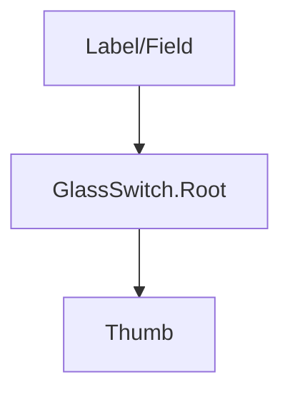

## SECTION 1 — Executive Summary
- **Purpose:** Glass-themed on/off toggle control.
- **Maturity:** Low-Medium.
- **Audit score:** **55/100**.
- **Why refactor:** Minimal wrapper with hardcoded visuals; no standardized sizing/status/read-only patterns.
- **Expected outcome:** Predictable toggle primitive aligned with form control standards.

## SECTION 2 — Current Problems
- No size/variant/status API.
- No explicit readonly/loading/pending contract.
- Hardcoded motion/gradient/shadow values.
- No documented label composition guidance.

## SECTION 3 — Refactor Goals (Priority)
1. Standardize switch contract (`checked/defaultChecked/onCheckedChange` + status/sizes).
2. Add readonly/loading semantics.
3. Tokenize visuals and motion.
4. Improve docs/tests.

## SECTION 4 — Public API
- Controlled/uncontrolled toggle props retained.
- Add `size`, `status`, `readonly`, `loading`.
- Keep native switch semantics from Radix.
- Future extensibility: labeled switch row composition helper.

## SECTION 5 — Component States
Off/on, hover, focus, active, disabled, readonly, loading, error/success/warning, pending.

## SECTION 6 — Composition Model
Standalone root + thumb; external label composition recommended.

## SECTION 7 — Accessibility Requirements
- Keyboard toggle via Space/Enter per primitive behavior.
- Label association required in docs.
- `aria-checked`, `aria-invalid`, `aria-describedby` support.
- Touch target minimum compliant.

## SECTION 8 — Design & Visual Language
Tokenized track/thumb dimensions, status colors, focus ring, motion speed, glass treatment.

## SECTION 9 — Design Tokens
Switch track/thumb/status/focus/motion/glass tokens.

## SECTION 10 — Performance Considerations
Keep thumb transition cheap and deterministic; avoid layout-shifting animations.

## SECTION 11 — Breaking Changes
Canonical size/status/read-only API additions may require migration from class-based custom styling.

## SECTION 12 — Test Plan
Controlled/uncontrolled behavior, keyboard toggle, disabled/readonly/loading states, accessibility assertions.

## SECTION 13 — Documentation Requirements
Basic, labeled switch rows, status examples, forms integration, accessibility notes.

## SECTION 14 — Acceptance Criteria
Switch reaches standards compliance with complete API/state/docs/test coverage.

## SECTION 15 — Refactor Checklist
- □ Add size/status/readonly/loading APIs  
- □ Tokenize visuals/motion  
- □ Add robust tests  
- □ Publish accessibility-focused docs

## SECTION 16 — Future Opportunities
Grouped preference toggles and async optimistic switch helpers.