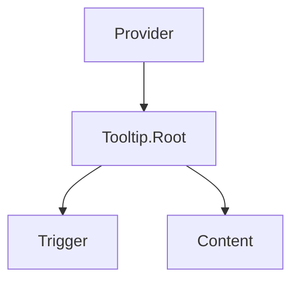

## SECTION 1 — Executive Summary
- **Purpose:** Lightweight glass-themed hint overlay.
- **Maturity:** Low.
- **Audit score:** **46/100**.
- **Why refactor:** Minimal wrapper with hardcoded styles; no standardized variant/size/state contract.
- **Expected outcome:** Small but fully standardized and documented overlay primitive.

## SECTION 2 — Current Problems
- No variants/sizes.
- Hardcoded visual/motion values.
- No documented delay strategy or reduced-motion behavior.
- Composition contract is implicit only (Radix pass-through).

## SECTION 3 — Refactor Goals (Priority)
1. Standardize API parity with overlay family.
2. Tokenize style/motion.
3. Document accessibility/interaction rules.
4. Add focused regression tests.

## SECTION 4 — Public API
- Root/Provider controls: `delayDuration`, `skipDelayDuration`, `disableHoverableContent`.
- Content: `variant`, `size`, `side`, `align`, `sideOffset`.
- Controlled open support remains via Radix.
- Defaults documented and standardized.

## SECTION 5 — Component States
Closed/opening/open/closing, hover/focus-triggered, disabled trigger handling, reduced-motion open/close.

## SECTION 6 — Composition Model
Compound: Provider → Root → Trigger + Content.

## SECTION 7 — Accessibility Requirements
- Keyboard-trigger support via focus.
- `aria-describedby` linkage.
- Dismissal behavior and non-focus-trapping semantics.
- Touch fallback behavior explicitly defined.

## SECTION 8 — Design & Visual Language
Tokenized bubble spacing, radius, border, text, motion; glass theme consistency in dark/light.

## SECTION 9 — Design Tokens
Tooltip surface/text/shadow/radius/spacing/motion/glass tokens.

## SECTION 10 — Performance Considerations
Portal usage minimal; avoid expensive animations and long delays.

## SECTION 11 — Breaking Changes
Introducing variant/size contract may require migration from className-only customization.

## SECTION 12 — Test Plan
Hover/focus open, keyboard semantics, delay behavior, side positioning, a11y link assertions.

## SECTION 13 — Documentation Requirements
Basic, delays, rich content constraints, accessibility and touch caveats.

## SECTION 14 — Acceptance Criteria
Consistent overlay API, accessibility compliance, token-only visuals, complete docs/tests.

## SECTION 15 — Refactor Checklist
- □ Add standardized API props  
- □ Tokenize style/motion  
- □ Add interaction/a11y tests  
- □ Publish usage guidance

## SECTION 16 — Future Opportunities
Smart collision-aware motion presets, global tooltip policy provider.