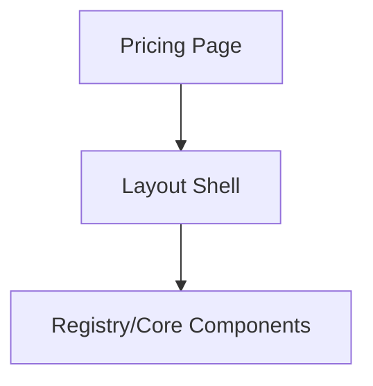

## SECTION 1 — Executive Summary

- Purpose: `Pricing Page` is a `Miscellaneous` component in Ein UI.
- Current maturity: `Low`.
- Current score from COMPONENT_AUDIT.md: `40 / 100`.
- Why this refactor is needed: API consistency, accessibility completeness, and token-driven theming are not yet fully standardized for this component category.
- Expected outcome after refactoring: a standards-compliant, typed, theme-aware component with clear behavior and documentation.

## SECTION 2 — Current Problems

Verified source: `registry/blocks/pricing/page.tsx`

- API inconsistencies: naming/prop/state conventions are not fully aligned library-wide per audit.
- Visual inconsistencies: hardcoded utility styles appear across the library instead of shared tokens.
- Accessibility gaps: keyboard/screen-reader behavior is not fully validated by tests for this component.
- Performance issues: no explicit performance guardrails are documented for this component.
- Missing states: loading/success/error/warning/readonly/selected/pending are not consistently modeled across the system.
- Missing variants/sizes/themes: not fully standardized to `COMPONENT_STANDARDS.md` set.
- Missing composition patterns: not fully documented for reusable and predictable composition.
- Technical debt: sparse tests and sparse component-level docs noted by audit.
- If something is implementation-specific and not explicitly visible in current source/audit, it is intentionally marked as requiring verification during implementation.

## SECTION 3 — Refactor Goals

Priority order:
1. Standardize API and naming to `COMPONENT_STANDARDS.md`.
2. Close accessibility and keyboard behavior gaps.
3. Normalize variants/sizes/states/themes.
4. Move styling to design tokens (no hardcoded values).
5. Improve composability and DX.
6. Improve performance and maintainability.
7. Reduce complexity and undocumented behavior.

## SECTION 4 — Public API

Design target (no implementation code):

- Props
  - `variant`: use allowed semantic variants only.
  - `size`: use `xs|sm|md|lg|xl|icon` where applicable.
  - `className`, `style`, `children`.
  - Interactive props when applicable: `disabled`, `loading`, `asChild`.
  - Controlled API when applicable: `value`, `defaultValue`, `onChange`.
  - Overlay API when applicable: `open`, `defaultOpen`, `onOpenChange`.
- Themes
  - Support token-driven theme behavior, including glass semantics where applicable.
- Events
  - Keep native/react event passthrough predictable.
- Composition
  - Favor composition over prop explosion.
- Defaults
  - Provide deterministic defaults for variant/size/state.
- Deprecated props
  - Any legacy aliases should be marked deprecated and retained temporarily.
- Removed props
  - Remove only if migration path is documented.
- Future extensibility
  - Reserve API shape for future slots/hooks without breaking existing contracts.

Reasoning:
- This aligns API predictability across the full design system and reduces future breaking changes.

## SECTION 5 — Component States

Supported states target:
- Default
- Hover
- Active
- Focus
- Disabled
- Loading
- Success
- Error
- Warning
- Readonly
- Selected
- Pending

For each state, implementation must define:
- Purpose
- Behavior
- Visual appearance
- Interaction rules
- Accessibility requirements

## SECTION 6 — Composition Model

- Should remain page-level composition built from primitives.
- Avoid growing a monolithic API; compose via existing UI components.
- Do not expose as a low-level primitive.

## SECTION 7 — Accessibility Requirements

Specify and enforce:
- Keyboard interactions for all interactive affordances.
- Proper ARIA role/attributes for the component type.
- Focus management and visible focus ring.
- Screen reader behavior for labels, descriptions, and state changes.
- Reduced motion handling.
- Touch target and touch interaction behavior.
- WCAG considerations (contrast, focus visibility, operability).

Acceptance criteria:
- Keyboard-operable.
- Screen-reader understandable.
- Focus-visible compliant.
- No hidden/undocumented inaccessible behavior.

## SECTION 8 — Design & Visual Language

Must align with `docs/standards/COMPONENT_STANDARDS.md`:
- spacing and sizing scale
- typography tokens
- border/radius/shadow tokens
- glass behavior (blur/opacity/border/reflection/shadow) where applicable
- dark mode and light mode parity
- consistent motion/transition feedback

## SECTION 9 — Design Tokens

Consume token categories only (no hardcoding):
- Color tokens
- Radius tokens
- Spacing tokens
- Shadow tokens
- Motion tokens
- Typography tokens
- Glass tokens (when applicable)

## SECTION 10 — Performance Considerations

- Identify potential re-render hotspots and avoid unnecessary state/effects.
- Prefer memoization only where measurable.
- Keep bundle impact minimal and imports modular.
- Preserve tree-shaking.
- Ensure SSR compatibility.
- Ensure React Server Components compatibility where applicable.
- Avoid hydration mismatch from runtime-only class decisions.

## SECTION 11 — Breaking Changes

- Potential breaking changes: API normalization (variant/size/state prop naming), deprecated aliases removal, behavior alignment.
- Migration risks: downstream usage relying on legacy prop names or implicit defaults.
- Backward compatibility strategy: deprecate first, remove in major release.
- Migration guide outline:
  1. map old prop names to new standard names
  2. map old variants/sizes to standard sets
  3. verify accessibility/state behavior parity

## SECTION 12 — Test Plan

Required tests:
- Rendering
- Interaction
- Keyboard
- Accessibility
- Variants
- States
- Regression
- Edge cases

No tests are implemented in this RFC.

## SECTION 13 — Documentation Requirements

Required docs examples:
- Basic usage
- Variants
- Sizes
- States
- Accessibility
- Composition
- Best practices
- Common mistakes
- Migration notes

## SECTION 14 — Acceptance Criteria

`Pricing Page` is complete only if:
- fully compliant with `COMPONENT_STANDARDS.md`
- resolves relevant findings from `COMPONENT_AUDIT.md`
- public API finalized and documented
- accessibility complete
- theme-aware and token-driven
- fully typed
- no undocumented behavior
- no unnecessary complexity
- no unresolved audit findings for this component

## SECTION 15 — Refactor Checklist

- [ ] Simplify and standardize API
- [ ] Remove/deprecate non-standard props
- [ ] Add/normalize required states
- [ ] Replace hardcoded styles with tokens
- [ ] Improve accessibility
- [ ] Improve tests
- [ ] Update documentation
- [ ] Verify performance and SSR/RSC behavior

## SECTION 16 — Future Opportunities

Out of scope for this refactor but recommended:
- richer compound patterns and slots where it improves composition
- advanced state orchestration helpers
- stricter runtime/dev warnings for incorrect usage
- deeper visual/performance tuning after baseline standardization
